# 《未竟之愿》技术策划设计文档

> 个人开发的 2D 像素类魂动作游戏 · Unity 6 (URP) / C# · [GitHub 源码](https://github.com/Qimiaowan666/unfulfilled-wish) · [演示视频](https://www.bilibili.com/video/BV1Wn326vEBE)

---

# 战斗系统(设计 + 实现)

> 一句话:本作的战斗不是"扛伤—还手"的血量消耗战,而是一套**"读招→弹反→削韧→破韧→处决"**的节奏博弈。防守动作本身就是进攻的起手式——挡对了、破对了,才有资格处决。

---

## 1. 设计目标:让"防守"成为进攻的起手,而不是苟活手段

类魂动作里最容易做坏的一点,是把"格挡"做成一个单纯减伤的乌龟按钮。本作从一开始就把设计意图钉死在一句话上:

- **玩家的核心资源不是自己的血,而是敌人的"韧性(Poise)"。** 赢的路径是持续削敌人韧性、把它削到 0 触发硬直,然后处决,而不是拼血条。
- **每一个防守动作都要有"进攻回报"。** 完美格挡 / 识破不仅免伤,还会**削敌韧 + 赎回自己的虚血 + 攒技能体力**——防得漂亮就等于在进攻。
- **逼玩家读招,而不是无脑长按。** 通过"完美窗口 + 连按缩窗惩罚"(格挡)和"红招只能识破"(识破)的规则,让"看清这一下是什么、在正确时机按正确键"成为唯一稳定解。

这套目标直接决定了后面每一条规则的数值取向:防守收益给得慷慨(鼓励主动弹反),但**乱按要罚**(窗口缩水),**挡错类型要吃满伤**(红招格挡无效)。

---

## 2. 核心循环:读招 → 弹反 → 削韧 → 破韧 → 处决

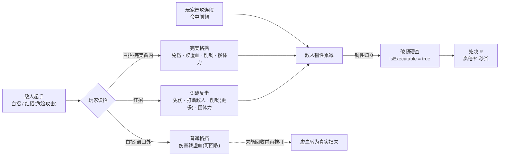

**削韧有三条来源,全部汇入同一根韧性条(`PoiseMeter`):**

1. **普攻连段命中** —— 每段带一份 `poiseDamage`(`PlayerController.cs:63`,默认 `{8, 10, 14}`),经 `EnemyBase.TakeDamage(dmg, poise)`(`EnemyBase.cs:450`)削韧。
2. **完美格挡反震** —— 挡下白招时对攻击者 `ApplyPoiseDamage`(纯削韧不掉血,`Player_BlockState.cs:58` → `EnemyBase.cs:441`)。
3. **识破成功** —— 在打断敌人的同时再削一截韧性(`Player_CounterState.cs:68`)。

韧性条归 0 → `PoiseMeter` 触发一次性的 `OnPoiseBroken`(`PoiseMeter.cs:39`)→ 敌人切入硬直态,`IsExecutable`(`= IsBroken && CurrentHP > 0`)转真 → 玩家进入处决射程即可 R 处决。**这条链路是整套战斗的胜利公式**,所有机制都在为"更快、更安全地削满这根条"服务。

> 韧性条的自愈是**有意做成"被持续骚扰就一直回不了"**:每次挨削都把回韧延迟计时器重置(`PoiseMeter.cs:37`),破韧期间 `Update` 直接 `return` 不回韧(`PoiseMeter.cs:22`)——那段"卡在 0"的时间正是处决窗口。

---

## 3. 三种防御手段的规则与触发条件

敌人的攻击分两类,防御遵循一套**"剪刀石头布"**的克制关系(判定集中在 `EnemyBase.ApplyHitToCollider`,`EnemyBase.cs:397`):

| 敌人攻击 | 视觉 | 唯一正解 | 挡错的后果 |
|---|---|---|---|
| **白招**(普通,`red=false`) | 常规 | **格挡 / 完美格挡** | 用识破接 → 识破不触发,继续吃实打 |
| **红招**(危险攻击,`red=true`) | 红色预警染色 + 放大 | **识破反击** | 格挡**无视格挡**、照样吃满伤 + 击退 |

`red` 是敌人招式数据里的一个布尔(`EnemyBase.cs:163`:"红=不可格挡 + 红视觉;白=可格挡"),近战/远程共用同一份命中处理。这个"白挡红破"的二分是逼玩家读招的根本手段。

### 3.1 完美格挡(Perfect Block)

- **进入方式**:按住右键 → `blockState`(全局的 `CheckCombatTransitions`,`PlayerBaseState.cs:30`)。
- **窗口**:每次"按下边沿"开一个完美窗 `ArmWindow`(`Player_BlockState.cs:23`),窗口时长在 `Update` 里递减(`:39`)。
- **命中判定**:敌人打到玩家时,`EnemyBase` 反调 `ReceiveBlockHit → ReceiveAttack`(`PlayerController.cs:89` / `Player_BlockState.cs:50`)。落在完美窗内 = 完美格挡,否则 = 普通格挡。
- **完美格挡收益**(`Player_BlockState.cs:52–66`):免伤 + `RedeemGhostHP`(赎回虚血) + `GainStamina`(攒体力) + 对攻击者 `ApplyPoiseDamage`(削韧) + 冷白蓝火花特效 + 广播 `CombatSignals.RaisePerfectBlocked()`。

**防刷设计(重点取舍)**:为了不让玩家无脑狂点右键骗完美,`ArmWindow` 引入 `spamStacks`——近期每多按一次,下次完美窗就缩小 `perfectBlockShrinkPerPress`,直到下限 `perfectBlockMinWindow`;而**成功精防会立刻把惩罚清零**(`Player_BlockState.cs:54`,"连段弹反手感"),静默 `perfectBlockPenaltyResetTime` 也清零。结果是:**接得准 → 一直满窗;乱点 → 窗口越缩越难**,把"读招"逼成唯一稳定解。

### 3.2 普通格挡(Normal Block)——虚血入口

窗口外挡下白招,不是白挡,而是走 `OnNormalBlock`(`Player_BlockState.cs:70` → `PlayerStats.cs:92`):把伤害按 `ghostHPBlockRatio` 转成**可回收的"虚血"**(详见第 4 节),另发 `RaiseBlocked`。它是"读招失败但方向对了"的中间态——不至于吃满,但欠下一笔需要用后续进攻/弹反赎回的债。

### 3.3 识破反击(Counter)——专接红色危险攻击

- **进入方式**:按住右键**再点左键** → `counterState`。它挂在**全局过渡** `CheckGlobalTransitions`(`PlayerBaseState.cs:45`)上,**任意可操作态都能触发、不看韧性、随时可用**——这是它和格挡最大的区别:识破是主动读红招的反应键,不是资源技能。有独立冷却 `counterCooldown`。
- **窗口**:进态即开 `isInCounterWindow`(`Player_CounterState.cs:14`),窗口由**动画事件** `OnCounterWindowClosed` 关闭(`:39`),`stateTimer = counterWindow * 3` 仅作动画事件漏触发时的兜底(`:16`)。
- **命中判定**:红招打到玩家时,`ApplyHitToCollider` 走 unblockable 分支,`if (isCountering && ctrl.TryCounter(this)) return;`(`EnemyBase.cs:416`)——识破成功即免伤。
- **识破成功收益**(`Player_CounterState.cs:58–69`):`RedeemGhostHP`(赎虚血,量比完美格挡更高) + `GainStamina`(体力更多) + `enemy.OnCountered()`(**打断敌人当前攻击**:boss 切踉跄态 `staggerState`,小怪基类空实现是有意设计,`EnemyBase.cs:493`) + `enemy.ApplyPoiseDamage(counterPoiseDamage)`(再削一截韧性) + 暖金火花 + `RaiseCountered`。

### 3.4 处决(Execute)

- **触发条件**:地面态按 R,在 `executeRange` 内 `OverlapCircle` 找到 `IsExecutable`(已破韧且未死)的敌人(`Player_GroundedState.cs:39` → `TryStartExecute`)。
- **结算**:`OnExecuted(attack × executeDamageMultiplier)`(`Player_ExecuteState.cs:54`),`EnemyBase.OnExecuted` 直接把 HP 置 0 秒杀(`EnemyBase.cs:465`)。
- **无敌帧**:进态开持续无敌 `SetInvulnerable(true)`,退态换成 `SetInvulnerableFor(0.35f)` 定时后摇无敌(`:71–72`)——两条无敌通道独立,避免期间的冲刺 Exit 误清掉后摇无敌(`PlayerStats.cs:150`)。
- **特例取舍**:处决**杀死 boss** 时刻意跳过通用顿帧/震屏(`:57`),把时间与镜头让给 `BossFinishUI` 的击破演出,避免抢 `timeScale`。

---

## 4. 虚血系统(Ghost HP):把"挡下的伤害"变成一笔可回收的债

虚血是"防守即进攻"在血条上的具象化。模型分三步(全部在 `PlayerStats.cs`):

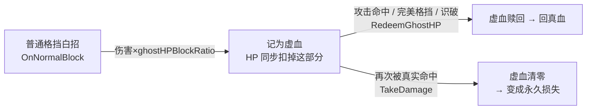

1. **产生**(`OnNormalBlock`,`PlayerStats.cs:92`):普通格挡把来袭伤害的一部分记为 `CurrentGhostHP`,同时 HP 扣掉这部分。血条上表现为"掉了血,但有一段可回收的虚影"——这是**能回收的债,不是白掉的血**。
2. **回收**(`RedeemGhostHP`,`PlayerStats.cs:112`):把虚血转回真实 HP。三个入口共用它——**攻击命中**(`OnAttackHit`,`:121`,每次砍中回一点)、**完美格挡**(`Player_BlockState.cs:56`)、**识破成功**(`Player_CounterState.cs:59`)。这就是"进攻/弹反赎回虚血"的闭环:想把血要回来,就得继续压制、继续接招。
3. **失效**(`TakeDamage`,`PlayerStats.cs:133`):**在回收之前再挨一记真实伤害,虚血直接清零**,那部分血就此坐实、再也拿不回来。

设计意图很直白:普通格挡不是"安全减伤",而是给你一个**限时的翻本机会**——你必须靠后续的主动进攻把它赎回来,一旦被打断(挨真伤)就血本无归。它奖励"挡完立刻还手"的进攻性打法,惩罚"挡完继续龟"的消极。

> **体力(Stamina)是纯进攻资源**:起始为 0(`PlayerStats.cs:63`,是设计不是 bug),**只能靠完美格挡 / 识破攒**,供技能消耗。这进一步把"防得好"和"打得出技能"绑定——又一处"防守即进攻"。

---

## 5. 实现:通用状态机 + `EntityState`

### 5.1 一套状态机,三方共用

玩家、小怪、boss **共用同一份通用 `StateMachine` + `EntityState` 基座**(`StateMachine/StateMachine.cs:1` 注释明说;无命名子类,旧空壳已删)。`StateMachine` 极薄:一个 `currentState` + 一个 `canChangeState` 开关,`ChangeState` 在 `Lock()` 时被忽略(仅玩家死亡用,`StateMachine.cs:14`)。`EntityState` 提供公共 `anim/rb/stateTimer` 和 `Enter/Update/Exit`,`Enter/Exit` 自动开关一个可选的 `animBool`(`EntityState.cs:31`)驱动 Animator。

玩家侧在 `PlayerBaseState` 上加了 `player/input` 引用 + 三层过渡 + 动画事件虚回调(`OnAnimationFinished / OnHitFrame / OnCounterWindowClosed`)。所有战斗态都遵循**"动画事件正常退出 + `stateTimer` 兜底退出"双保险**(动画事件漏触发会卡死)。

### 5.2 战斗相关状态类

| 状态类 | animBool | 职责 | 关键转移 |
|---|---|---|---|
| `Player_BlockState` | `isBlocking` | 完美/普通格挡、防刷缩窗 | 松开右键→`GroundedOrFall`;右键+左键→`counterState` |
| `Player_CounterState` | `isCountering` | 识破反击,接红招 | 窗口关+动画播完→`GroundedOrFall` |
| `Player_ExecuteState` | `isExecuting` | 处决,自带无敌帧 | 动画播完→`GroundedOrFall` |
| `Player_AttackState` | `isAttacking` | 三段连段、命中削韧、赎虚血 | 被识破/冲刺打断;连段排队 |
| `Player_StunnedState` | `isStunned` | 未防住时的受击硬直,承接击退 | `stateTimer` 到→`GroundedOrFall` |

### 5.3 过渡分三层(都在态的 `Update` 里串)

1. **全局过渡** `CheckGlobalTransitions`(`PlayerBaseState.cs:38`):**识破 → 冲刺 → 技能 Q/E**,任意可操作态都能打断(dash/dead/stunned/counter/heal 自屏蔽)。**识破挂在这一层**,所以"随时能接红招"。
2. **地面/空中专属** `CheckGroundedTransitions`(`Player_GroundedState.cs:15`):掉落、普攻、格挡、跳跃、处决。**格挡与普攻挂在这层**(经 `CheckCombatTransitions`,`PlayerBaseState.cs:30`),刻意**不放进全局层**——否则攻击/格挡会被"再按一次攻击/格挡"打断。
3. **各态自身收尾**:统一回家口子是 `PlayerController.GroundedOrFall`(落地→idle,半空→fall)。

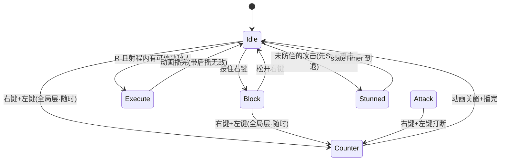

### 5.4 敌人攻击玩家的统一入口

所有敌人命中(近战 hitbox 与远程箭矢共用)都汇到 `EnemyBase.ApplyHitToCollider`(`EnemyBase.cs:397`):先读 `IsInvulnerable`(免伤直接 return)→ 读 `IsBlocking / IsCountering` 做"剪刀石头布"判定 → 未防住则 `stats.TakeDamage` + **先 `Stun` 再 `ApplyKnockback`**。这个顺序是必须的:`Player_StunnedState` 只在 `Enter` 归零一次速度、`Update` 不再每帧重设(`Player_StunnedState.cs:14`),而 idle/move 每帧重设速度会盖掉击退——所以推人前必须先切进硬直态,击退才滑得出来(`EnemyBase.cs:427` 注释)。

### 5.5 解耦:`CombatSignals` 事件总线

完美格挡 / 普通格挡 / 识破成功各自广播一个静态事件(`CombatSignals.cs:3`),把"玩家做对了某个防御动作"从具体敌人/场景里解耦出来,供教程等逻辑订阅。刻意让**完美格挡只发 `PerfectBlocked` 不发 `Blocked`**,以便教程把"普通/完美"分开计数。

---

## 6. 关键数值一览(代码默认值,Inspector 可覆盖)

> 以下为脚本里的默认值,可作为设计基线;实际运行以场景/prefab 的 Inspector 为准。逐敌人的**韧性上限/破韧阈值**由各 prefab 的 `PoiseMeter.maxPoise` 配置,差异较大,见【待填】。

**格挡(`PlayerController.cs:70–73`)**

| 参数 | 默认值 | 含义 |
|---|---|---|
| `perfectBlockWindow` | 0.15 s | 完美格挡基础窗口(每次按下开窗) |
| `perfectBlockMinWindow` | 0.03 s | 连续狂按时的窗口下限 |
| `perfectBlockShrinkPerPress` | 0.05 s | 每次近期重按缩小的窗口 |
| `perfectBlockPenaltyResetTime` | 0.5 s | 静默多久(或一次成功精防)清零惩罚 |

**识破 / 处决(`PlayerController.cs:76–82`)**

| 参数 | 默认值 | 含义 |
|---|---|---|
| `counterWindow` | 0.3 s | 识破窗口**基线**;实际有效窗由动画事件 `OnCounterWindowClosed` 决定 → 有效帧窗口【待填:以动画事件为准】 |
| `counterCooldown` | 0.5 s | 识破冷却 |
| `executeDamageMultiplier` | ×5 | 处决伤害倍率(实为直接置死) |
| `executeRange` | 1.5 | 处决检索半径 |
| 处决后摇无敌 | 0.35 s | `SetInvulnerableFor` |

**防守收益 / 削韧(`PlayerStats.cs:19–31`)**

| 参数 | 默认值 | 含义 |
|---|---|---|
| `ghostHPBlockRatio` | 0.5 | 普通格挡:来袭伤害 × 此值 → 虚血 |
| `perfectBlockHealAmount` / `counterHealAmount` / `attackHealAmount` | 20 / 40 / 5 | 各来源单次赎回虚血量 |
| `perfectBlockStaminaGain` / `counterStaminaGain` | 20 / 40 | 攒体力(起始 0,上限 `maxStamina`=100) |
| `perfectBlockPoiseDamage` / `counterPoiseDamage` | 5 / 15 | 完美格挡 / 识破的削韧量 |

**连段削韧(`PlayerController.cs:60–63`)**:`maxComboStep`=3,`attackDamageMultipliers`={1, 1, 1.2},`attackPoiseDamage`={8, 10, 14},`comboResetTime`=0.8 s。

**韧性条(`PoiseMeter.cs:6–8`)**:`maxPoise`=100(基类默认;**逐敌人 prefab 覆盖 →【待填:各敌人/boss 的 maxPoise 即破韧阈值】**),`poiseRegenRate`=10/s,`regenDelay`=3 s。

---

## 7. 设计取舍(为什么这么做)

- **完美/普通格挡合进同一个 `blockState`,用"窗口内外"分流,而不是两个独立按键。** 让玩家只需管一个"按住右键"的直觉动作,把技术深度压在"松开-再按的时机"上,而不是记忆多套键位。代价是完美窗判定全靠一个计时器,必须配防刷逻辑兜底。
- **识破放在全局过渡层、格挡/普攻放在地面层。** 识破要"随时能接红招",必须能打断包括攻击态在内的一切;而格挡/普攻若也全局化,会导致挥砍被"再按一下"自打断。这条分层是刻意的(`PlayerBaseState.cs:28` 注释)。
- **红招格挡无效、必须识破。** 这是逼玩家读招的核心杠杆:如果格挡能兜住一切,识破就没有存在意义,战斗退化成长按乌龟。代价是对新手不友好,需要靠红色预警染色(`DamageFeedback` 的 `HoldWarning`)做足视觉提示。
- **虚血"挡了先扣、再靠进攻赎回、挨打即坐实"。** 相比"直接减伤",这套把防守收益**延迟兑现并绑定到后续进攻**,从数值层面强制"防守→反击"的节奏,而不是"防守→continue龟"。代价是血条读数更复杂,需要 UI 用虚影层把"真血/虚血"讲清楚。
- **体力起始为 0、只能靠弹反攒。** 让技能成为"打得好的奖励"而非"开局白嫖",与整体"主动进攻"基调一致。代价是开局手感偏克制,需要引导玩家先学会弹反。
- **削韧三源汇一条 `PoiseMeter`、破韧靠一次性边沿事件 + `IsExecutable` 持续查询。** 把"进度累积(连续)"与"破韧触发(离散)"分开,避免重复监听;但要求"凡离开硬直必 `ResetPoise`",否则韧性条永久卡 0(`Enemy_StunnedState.cs:33` / `Boss_StunnedState.cs:32` 专门做了复位)。
- **处决对普通敌人 = 顿帧+强震,对 boss 击破 = 让位专属演出。** 通用打击感与 boss 的仪式感演出会抢 `timeScale`,故在 `Player_ExecuteState.cs:57` 分流。代价是处决表现有两套代码路径,改动需同时顾及。

---

### 附:相关源码索引

- 通用状态机:`Assets/Scripts/StateMachine/StateMachine.cs`、`EntityState.cs`
- 玩家状态基类与过渡:`Assets/Scripts/Player/PlayerBaseState.cs`、`States/_Base/Player_GroundedState.cs`
- 防御三态:`States/Defense/Player_BlockState.cs`、`Player_CounterState.cs`、`States/Attack/Player_ExecuteState.cs`
- 受击硬直/连段:`States/Reaction/Player_StunnedState.cs`、`States/Attack/Player_AttackState.cs`
- 数值/虚血/韧性收益:`Assets/Scripts/Player/PlayerStats.cs`、`Player/PlayerController.cs`
- 韧性条与信号总线:`Assets/Scripts/Combat/PoiseMeter.cs`、`Combat/CombatSignals.cs`
- 敌人命中入口/削韧/处决:`Assets/Scripts/Enemy/EnemyBase.cs`(`ApplyHitToCollider:397`、`TakeDamage:450`、`ApplyPoiseDamage:441`、`OnExecuted:465`、`OnCountered:494`、`HitData.red:163`)

---

# 数据驱动攻击系统(三层 + 可插拔)

> 这是《未竟之愿》敌人战斗的**核心引擎**:所有"会打你的东西"——地面小怪与关卡 Boss——共用同一套攻击系统。配一招新攻击、一套新连段、一种新走位,基本不写代码:在 Inspector 里下拉选类型、填参数即可。
>
> 相关文件:`Enemy/EnemyBase.cs`(数据模型 + 抽签)、`Enemy/AttackRunner.cs`(运行器)、`Enemy/StepMovers.cs`(出招前位移)、`Enemy/AttackDrivers.cs`(出招时打法)、`Enemy/EnemyAnimationEvents.cs`(动画事件接线)、`Util/SubclassSelectorAttribute.cs` + `Editor/SubclassSelectorDrawer.cs`(多态下拉)。

---

## 一、要解决的问题(设计意图)

类魂动作游戏里,**敌人的招式与连段丰富度**几乎等于战斗深度的卖点。但如果每加一招、每串一套连段、每换一种走位都要:①写一段专用 C# ②去 Animator 图里连一条新过渡 ③在小怪和 Boss 两套代码里各改一遍——迭代成本会随内容量爆炸,而且**小怪和 Boss 各写一套逻辑必然漂移**(命中判定、格挡规则、击退手感慢慢对不齐)。

本系统用三条设计决策解决它:

1. **招是数据,不是代码。** "打什么"(伤害/击退/命中盒/红白)被抽成纯数据 `HitProfile` / `EnemyAttack`,在 Inspector 上填。运行时代码只**读**,不为某一招写分支。
2. **"怎么到位、怎么打"是可插拔策略。** 出招**前**的走位(逼近/后撤/瞬移/跳)和出招**中**的打法(前冲/跳劈/挑飞)各是一个多态槽,用 `[SerializeReference] + 下拉选择器` 挂在连段的每一段上。加新行为 = 写一个新子类,**下拉里自动多一项,所有怪立即可用**。
3. **一套运行器,AI 分叉。** 招池 / 连段 / 命中 / 驱动全部上移到公共基类 `EnemyBase` + 统一运行器 `AttackRunner`;小怪和 Boss 只在"AI 决策层"(状态机)各走各的,攻击态本身是只调 `Begin/Tick/Cancel` 的**薄壳**。

> **分层的本质是关注点分离:** "打什么"(命中数据)/ "怎么串、何时放"(连段编排)/ "怎么到位、怎么打"(走位与打法策略)三者解耦。解耦带来的直接红利是**复用**——同一招 `attack` 能被"贴脸普砍段""瞬移偷袭段""跳劈接大招段"以完全不同的方式使用,而招本身一个字不用改。

---

## 二、三层数据模型:命中 → 招 → 连段

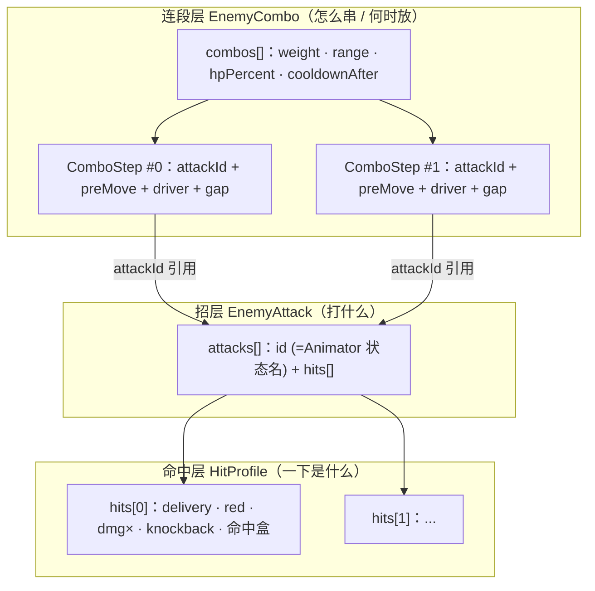

**三层各管一件事,越往下越"纯":**

| 层 | 类 | 回答的问题 | 关键点 |
|---|---|---|---|
| 命中层 | `HitProfile` | 这**一下**打出去是什么 | 自包含;一招可挂多下 |
| 招层 | `EnemyAttack` | 这**一招**打什么 | 纯打击数据,不含位移/节奏 |
| 连段层 | `EnemyCombo` / `ComboStep` | 怎么**串**、何时放、怎么**到位/打** | gating(距离/血量/权重)+ 两个可插拔槽 |

### 2.1 命中层 `HitProfile` —— "一下命中是什么"(自包含)

定义在 `EnemyBase.cs:159-172`。一招挂一串 `hits`,动画事件 `Fire(i)` 引用第 `i` 下。字段与默认值:

| 字段 | 含义 | 代码默认 |
|---|---|---|
| `delivery` | `Melee` 近战命中盒 / `Ranged` 发射箭矢 | `Melee` |
| `red` | **红=不可格挡 + 红色视觉**;白=可格挡 | `false` |
| `damageMultiplier` | 伤害 = 敌人 `attack` × 此值 | `1` |
| `knockback` / `hitStun` | 击退力 / 命中硬直 | `5` / `0` |
| `hitboxOffset` / `hitboxSize` | 近战命中盒(相对身体,自动按朝向翻转) | `(0.7,0)` / `(1,0.8)` |
| `projectilePrefab` | 远程(Ranged)发射的箭 | — |

> **为什么"一下"要自包含?** 因为一招常常不止打一下(挑飞:横劈一下 + 下砸一下),而这几下的红白/伤害/命中盒可以各不相同。把命中做成独立的 `hits[i]` 数组,配合动画事件 `Fire(i)` 精确到第几帧打第几下,就能在**同一个 clip** 里编排多段命中,而不必为"两下"写两招。
>
> `red` 字段是连接**战斗核心(防御剪刀石头布)**的接口:白招走"格挡"防线、红招走"识破反击"防线(见 §五)。红招还统一套用固定视觉——红染 `DangerTint` + 放大 `DangerScale = 1.4`(`EnemyBase.cs:225-226`),数值归各 hit 配、视觉归全局约定,风格统一且零重复。

### 2.2 招层 `EnemyAttack` —— "打什么"(纯打击数据)

定义在 `EnemyBase.cs:174-182`:

| 字段 | 含义 |
|---|---|
| `id` | **双重身份**:①连段按它引用 ②**必须是 Animator 里的状态名**(出招 `Anim.Play(id)` 强播这个 clip) |
| `hits[]` | 这招打出的每一下(`HitProfile`) |
| `showGizmo` | 是否画命中盒 gizmo(仅调试) |

> **招里为什么一点位移/节奏/动画速度都没有?** 这是本系统最关键的一刀切:那些全在连段的"段"上(`animSpeed`/`preMove`/`driver`/`gap`)。招只留下"纯打击数据",于是**同一招能被不同段以不同方式使用**——普砍段直接砍、偷袭段瞬移到背后再砍、追击段前冲着砍,复用的都是同一个 `attack`。
>
> `id` 既当引用键又当 Animator 状态名是**有意的约定**:省掉一层"招→clip"映射表,代价是 id 必须和状态名严格对齐,对不上会**静默失败**(动画放不出、`Fire` 事件不触发)。开发期靠 `GroundEnemy.ValidateAttacks`(`GroundEnemy.cs:112`,仅 Editor)自检 id↔Animator、远程缺箭矢等兜底。

### 2.3 连段层 `EnemyCombo` + `ComboStep` —— "怎么串、何时放 / 怎么到位、怎么打"

一只怪可配多套连段,出招时按**权重 + 距离 + 血量**抽一套。`EnemyCombo` 定义在 `EnemyBase.cs:201-217`:

| 字段 | 含义 | 代码默认 |
|---|---|---|
| `name` | 名字(标识 + 强制连段按名引用) | `"combo"` |
| `weight` | 抽签权重;`0` = 不随机抽(配合强制开场) | `1` |
| `range` (双滑块) | 可被抽中的**距离区间**(米);玩家在 `[min,max]` 内才可能抽到 | `(0,2)` |
| `hpPercent` (双滑块) | 可被抽中的**血量区间**(0~1) | `(0,1)` |
| `noRepeat` | 不连续抽到同一套(**软偏好**,见下) | `false` |
| `cooldownAfter` | 整套打完的冷却(秒);≤0 用 `defaultAttackCooldown` | `0` |
| `stepGap` | 段间默认停顿(秒),0=无缝;每段可用自己的 `gap` 覆盖 | `0.08` |
| `steps[]` | 这套连段的每一段(`ComboStep`) | — |

`ComboStep`(`EnemyBase.cs:185-198`)——这是**装配可插拔槽的地方**:

| 字段 | 含义 |
|---|---|
| `attackId` | 打哪招(引用 `attacks[].id`) |
| **`preMove`** | **出招前位移**,可插拔 `StepMover`(留空=不动)—— `EnemyBase.cs:191` |
| **`driver`** | **出招时编排**,可插拔 `AttackDriverBase`(留空=普通挥砍)—— `EnemyBase.cs:193` |
| `animSpeed` | 动画播放速度;≤0=原速 |
| `gap` | 本段打完后的停顿;<0=用连段的 `stepGap` |

> **gating(距离 + 血量 + 权重)为什么强?** 它把"阶段/情境判断"从状态机代码里挪进了数据:
> - **配一个 `hpPercent = (0, 0.3)` 的低血段,残血才会放**——不必为"进入狂暴期换招"写任何阶段状态机;
> - **配不同 `range` 的段,自然形成"远用突进、近用连斩"**——"打哪招"完全交给各连段自己的距离区间,Boss 的决策 hub 只管"够不够得着"。

**派生的决策距离:** 系统不设专门的 `attackRange` 字段——`MaxComboRange()`(`EnemyBase.cs:244`)取所有连段 `range.y` 的最大值当"出手/追击边界"(没连段则回退 1.5)。Boss 用它决定"打不了时该追还是站等",在范围内具体打哪招则由各连段的 `range` 自行 gating。

**抽签逻辑** `TryPickCombo(dist)`(`EnemyBase.cs:254`):先看有没有强制连段(`forcedComboName`,开场/转阶段用,`ForceCombo` 设、用过即清),否则用一个内联的 `Weight()` 函数把不满足 距离/血量 的连段权重归零,再交给 `WeightedPicker` 加权抽。`noRepeat` 是**软偏好**——先排除上一套抽一次,若抽不到(比如某距离区间只有这一套)再放开重抽:

```csharp
c = PickAttack(combos, x => Weight(x, true));   // 先排除上一套
// 开了 noRepeat 但池子里只有这唯一一套时，允许再出它，避免卡住哑火
if (c == null) c = PickAttack(combos, x => Weight(x, false));
```

> **为什么要"软"?** 硬排除会在"某范围只有一套连段"时让怪**哑火卡住**(抽不到任何招、干站着)。软偏好保证了"尽量别重复,但绝不为了不重复而无招可出"。—— `EnemyBase.cs:278-280`

---

## 三、可插拔的两个相位槽(策略模式 / 多态字段)

出招被拆成两个正交的相位,各挂一个**多态策略字段**——都是 `[SerializeReference, SubclassSelector]`:

```csharp
// EnemyBase.cs:190-193  ——  ComboStep 里并列的两个可插拔槽
[Header("出招前（把敌人挪到位；留空=不动）")]
[SerializeReference, SubclassSelector] public StepMover preMove;        // :191
[Header("出招时（这一下怎么打；留空=普通挥砍）")]
[SerializeReference, SubclassSelector] public AttackDriverBase driver;  // :193
```

### 3.1 出招前 `preMove`(`StepMover`)——把敌人挪到位,到位了才挥砍

基类 `StepMover`(`StepMovers.cs:6`)。契约极简:`Begin` 起手、`Tick` 每帧返回 `bool`(**true=到位、可挥砍**)、`Cancel` 被打断时恢复物理/无敌/可见。当前子类:

| 下拉名(`[TypeLabel]`) | 类 | 行为 |
|---|---|---|
| 逼近 (走近) | `ApproachMover` | 朝玩家走到 `reach`(默认 1.2)内就停(遇崖/超时也停) |
| 后撤 (走开) | `RetreatMover` | 背对玩家走,遇崖/超时停 |
| 瞬移 (闪身) | `TeleportMover` | 淡出→闪到身后/身前/另一侧(贴墙修正)→淡入→硬直;飞行中无敌 |
| 跳接近 (先跳后砍) | `JumpMover` | 抛物线跳到玩家身位,**落地后再起手砍**;腾空无敌 |

### 3.2 出招时 `driver`(`AttackDriverBase`)——挥砍过程中的位移 + 命中编排

基类 `AttackDriverBase`(`AttackDrivers.cs:7`)。契约:`Begin`(记起点/设无敌·kinematic)、`Tick`(每帧驱动位移)、`OnFire(i)`(接管动画事件 `Fire(i)`)、`End`(恢复)。当前子类:

| 下拉名 | 类 | 行为 |
|---|---|---|
| 挑飞 (横劈→砸) | `LaunchDriver` | `Fire(0)` 横劈挑起玩家→boss 延迟追上→`Fire(1)` 一起砸地;不锁定,空中可翻滚/格挡挣脱 |
| 跳劈 (边跳边砍) | `JumpDriver` | 抛物线跳向玩家,**攻击 clip 与跳同时**,落地劈中;腾空无敌 |
| 前冲 | `LungeForward` | 挥砍中朝玩家前冲(离玩家 >1.5 才冲) |
| 后撤 | `LungeBackward` | 挥砍中背身后撤(遇崖停) |

> **两个"跳"不是重复,是两个相位的正确形态:**
> - `JumpMover`(preMove 槽)= "**先**跳到位、落地**再**起手砍",纯接近用;
> - `JumpDriver`(driver 槽)= "跳和砍**同时**、落地劈中",是跳劈的战斗形态。
>
> 这正说明了两个槽的价值:同一个"跳"的动作,放在不同相位语义完全不同,而系统天然区分它们。

### 3.3 为什么用 `[SerializeReference]` + 自定义下拉,而不是枚举 switch / 子 SO?

三种可选实现的对比,解释这里的取舍:

| 方案 | 加新行为的代价 | 参数归属 | 复用性 |
|---|---|---|---|
| **枚举 + switch** | 改枚举 + 改运行器 switch + 加字段 | 字段散在 EnemyBase | 差,耦合运行器 |
| **子 ScriptableObject** | 建一个 SO 资产,再引用 | 在 SO 资产上(多怪共享→改一个动全部) | 引用共享,不能逐段独立调 |
| ✅ **`[SerializeReference]` 多态字段** | **只写一个子类** | **参数随段实例走**,逐段独立 | 任何怪挂上就能用,零耦合 |

`[SerializeReference]` 让一个字段能序列化**任意子类实例**(多态),参数直接内嵌在**连段的那一段上**——所以给小怪某段的 preMove 选"瞬移",它就会闪身偷袭,**零代码、不共享、可逐段单独调参**。

配套的 Inspector 体验由两个小工具实现:
- `SubclassSelectorAttribute` / `TypeLabelAttribute`(`Util/SubclassSelectorAttribute.cs`):前者是标记特性,后者给子类标中文下拉名。
- `SubclassSelectorDrawer`(`Editor/SubclassSelectorDrawer.cs`):用 `TypeCache.GetTypesDerivedFrom(baseType)` 列出所有**非抽象**子类(`:86-92`),读 `[TypeLabel]` 显示中文名(`:13`,不标则回退类名),选中后手动遍历把该类型的参数展开在下面。

> **一处值得记的实现取舍:** drawer 故意**不用 foldout**(`SubclassSelectorDrawer.cs:8` 注释)——foldout 的整行点击区会把类型下拉按钮的点击"吃掉",导致选了类型却改不动。用 `PrefixLabel + DropdownButton` 手绘,规避了这个 Unity 老坑。另外菜单回调是延后执行的,`SerializedProperty` 句柄可能失效,所以 `Set` 用 `serializedObject + propertyPath` 重取(`:97-103`)。
>
> **这套机制的净效果:** 只要新写的类标了 `[System.Serializable]` 并继承对应基类,**下拉里自动多一项,所有怪立即可用**——不动运行器、不动 EnemyBase、不改任何现有怪。这是整章"可扩展性"的技术支点。

---

## 四、运行器 `AttackRunner`:把数据跑成相位机

`EnemyBase` 持有一个 `AttackRunner`(`Attack` 属性,懒创建,`EnemyBase.cs:385`)。它把"一招/一套连段"跑成一个三相状态机 **`PreMove → Swing → Gap`**(`AttackRunner.cs:12`):

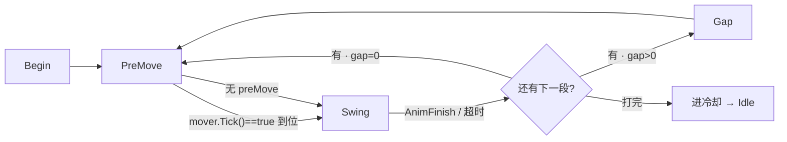

- **PreMove**:有 `preMove` 就每帧 `mover.Tick(e)`,返回 `true`(到位)才转 Swing(`AttackRunner.cs:68-70`)。
- **Swing**:先 `SetOnlyAnimBool("isAttacking")` 摁住攻击态、再 `PlayCurrentAttack()` 强播该招 clip(`:44-45`);有 `driver` 则每帧 `driver.Tick`。命中由动画事件触发(见下)。退出靠 clip 末帧事件 `AnimFinish`,或超时兜底(clip 时长 + 0.3s 余量,`:51-53`)。
- **Gap**:段间停顿,期间点亮 `isIdle` 撑住 idle 状态(否则 Entry/Exit 控制器会因 `isIdle==false` 立刻弹出→冻帧,`:93-95`),然后 `AdvanceCombo` 推进;打完 `Finish` 进冷却。

**命中转发的链路**(这是"招是数据"能贯穿到底的关键):动画 clip 上的 `Fire(i)` 事件 → `EnemyAnimationEvents.Fire(i)`(`EnemyAnimationEvents.cs:13`)→ `AttackRunner.OnFire(i)`:

```csharp
// AttackRunner.cs:119-123
public void OnFire(int i)
{
    if (phase == Phase.Swing && driver != null) { driver.OnFire(e, e.CurrentAttack, i); return; }
    e.DoFireHit(i);   // 无驱动：直接实打第 i 个 HitProfile（近战命中盒 / 远程发箭）
}
```

有 driver 就转给 `driver.OnFire` 让它协调(如挑飞把 `Fire(0)`=挑、`Fire(1)`=砸);没有就 `DoFireHit(i)` 直接读 `hits[i]` 实打(`EnemyBase.cs:320`)。**无论走哪条,伤害都 = `attack × DamageMultiplier × hit.damageMultiplier`,命中盒/红白都读同一个 `HitProfile`**——"打什么"始终是数据。

**被打断**(破韧/死亡/识破)调 `Cancel()`(`AttackRunner.cs:126`):`mover.Cancel` + `driver.End` 恢复物理/无敌/可见/动画速度,重置连段——否则怪会卡在 kinematic 或半透明。

> **薄壳证据:** 小怪 `Enemy_AttackState` 和 Boss `Boss_AttackState` 的 `Enter/Update/Exit` 全文加起来不到 30 行,都只是 `Attack.Begin() / Attack.Tick() / Attack.Cancel()`(`Mobs/States/Enemy_AttackState.cs` / `Boss/States/Boss_AttackState.cs`)。**改攻击逻辑只动核心层,两边同时受益。**

---

## 五、命中落地:接入战斗核心(防御剪刀石头布)

命中最终都汇入 `ApplyHitToCollider`(`EnemyBase.cs:397`)——近战 `PerformAttack` 与远程 `Arrow` 共用它,这是攻击系统与**玩家防御 / 韧性 / 虚血**核心的对接点:

- **白招(可格挡)** 被格挡 → `ctrl.ReceiveBlockHit(damage, this)`,不吃伤不击退(`:418-423`)。玩家侧据此区分**完美格挡**(完美窗口内,削敌人韧性)与**普通格挡**(窗口外,把伤害转为可回复的**虚血**)。
- **红招(不可格挡 `red`)** 无视格挡,只能被**识破反击** `ctrl.TryCounter(this)` 接住 → 免伤并给敌人削韧(`:413-417`)。
- 两者都没防住 → 扣血 + 击退。

> 完美格挡与识破反击都会**削减敌人韧性**,韧性被削满 → `PoiseMeter.OnPoiseBroken` → 敌人进硬直态、**可被处决**。具体的**削韧量 / 完美格挡窗口 / 虚血回收规则与数值**属于韧性(`Combat/PoiseMeter`)与玩家防御系统,详见对应章节;本节只强调:攻击系统通过每个 `HitProfile` 的 `red` 字段,把"这一下走哪条防线"编码进了数据。

**一个务必照做的顺序坑**(`EnemyBase.cs:425-433`):没防住时必须**先让玩家进硬直态、再给击退**。因为 idle/move 每帧会重设速度、盖掉击退,所以先 `ctrl.Stun(stun)`(硬直态 Enter 归零速度、之后不再每帧重设)再 `ApplyKnockback`,否则玩家推不动。

> **待填数值(属韧性/防御系统,勿在此编造):** 【待填:完美格挡窗口时长】【待填:完美格挡/识破各自的削韧量】【待填:虚血回收比例与规则】【待填:各敌人破韧所需总韧性】。

---

## 六、设计价值与取舍

### 6.1 价值

- **加招 / 连段 / 行为不改核心:** 新攻击 = 填 `attacks[]` + `combos[]` + 给 clip 加 `Fire(i)`/`AnimFinish` 事件(零代码);新走位/打法 = 写一个 `StepMover`/`AttackDriverBase` 子类(下拉自动出现,全怪可用)。
- **小怪与 Boss 共用运行器:** 命中、格挡、连段、驱动只有一处实现,手感与规则天然一致;两边只在 AI 决策层分叉。
- **策略参数随段走、可跨怪复用:** 所有 Mover/Driver 参数在段实例上、只调 `EnemyBase` 公共 API,**任何怪挂上就能用**——给小怪某段选"瞬移"它就会闪身偷袭。

**当前各敌人配置一览**(印证"同一套系统,配置驱动出不同性格"):

| 敌人 | 攻击/连段要点 |
|---|---|
| AoTengu | 最基础,单招,无位移/编排 |
| Archer | 远程放箭(Ranged hits)+ 后撤拉距 |
| DemonSamurai | 多招;`jumpattack` 段用 `LungeForward`(前冲) |
| MinotaurBoss | 跳劈接大招(`JumpDriver`)、挥飞接大招(`LaunchDriver`)、闪身斩/瞬移大招/二阶段开场(`TeleportMover`);低血/距离 gating + 强制开场 |

### 6.2 取舍(诚实的代价)

- **`[SerializeReference]` 的脆弱性:** 多态序列化按类型全名存;**重命名/移动子类命名空间会丢已配引用**。换灵活性的代价是这类重构要谨慎(可加 `[MovedFrom]` 兜)。
- **`id` = clip 名的静默失败:** 省了一层映射,代价是 id 对不上 Animator 时**不报错只不生效**;靠 `ValidateAttacks`(仅 Editor)+ gizmo 兜底。
- **数据化 vs 可视化:** 攻击走 `Anim.Play(招id)` 强播(开放集合、数据驱动),放弃了 Animator 图上的可视化连线——这是《动画驱动分类规范》里"开放/数据驱动 → `Anim.Play`,加东西不改图"的刻意选择;写死的 idle/走/受击仍用 bool 参数驱动。
- **`Fire(i)` 下标语义要对齐:** `i` 是 `hits[]` 下标,clip 上事件与配置必须一一对应,配错会打空;`LaunchDriver` 依赖 `Fire(0)=挑、Fire(1)=砸` 的约定。

### 6.3 这套系统是"重构"出来的(大重构的风险管理)⭐

上面这套统一运行器**不是一开始就有的**,是从两套并行的烂摊子重构合并而来——这段经历本身比"设计成什么样"更能说明工程能力。

- **重构前:** Boss 有 **5 个手写攻击状态类**(`Boss_Atk3State` / `Boss_JumpSlashState` / `Boss_NormalAttackState` / `Boss_RepositionState` / `Boss_SpecialAttackState`,合计 **590 行硬编码**);小怪(`GroundEnemy`)另有一套连段 / 命中逻辑。两套并行、每加一招都要写代码、Boss 与小怪**无法互相复用**位移与编排。
- **重构后(可量化):** 只算 C# 代码 **41 文件、+1193 / −1627(净删约 430 行)**;**删掉全部 5 个 Boss 攻击状态类**,新增 `AttackRunner` / `AttackDrivers` / `StepMovers` 三个**共享基建**,Boss 攻击态退化成 **29 行薄壳** `Boss_AttackState`。**用更少的代码同时承载了更多的怪和更强的可配性。**
- **风险管理:** Boss 是已打磨的 demo 核心,删旧状态类等于动战斗手感。所以重构前**专门打了一个回退点**(commit `51d7fa8`,提交信息即"统一攻击系统重构前存档"):先让新统一 Boss 跑到手感不退,再删旧类——**先建后拆、留退路**。
- **打断安全:** 迁移时还要保证被**破韧 / 识破 / 死亡**打断时,`Cancel()` 干净恢复 `kinematic` / 无敌 / 半透明 / 动画速度这些"招内临时全局态",否则 Boss 会卡死——这是把"两套怪合并到同一相位机"最容易漏的边界。

> 一句话:**这是"设计能力"之外,额外能拿出来的"重构 + 风控"证据**——净删代码、删掉 5 个状态类、设回退点、处理打断复原,四件事叠在一次重构里。

---

## 七、关键代码片段

**① 出招前位移基类 `StepMover`**(`StepMovers.cs:6`)——契约:`Tick` 返回 `bool` 表示"到位没":

```csharp
[System.Serializable]
public abstract class StepMover
{
    public abstract void Begin(EnemyBase e);   // 进入段前位移：setup
    public abstract bool Tick(EnemyBase e);    // 每帧；return true = 到位，可挥砍
    public virtual void Cancel(EnemyBase e) {} // 被打断：恢复物理/无敌/可见
    protected static float EaseOut(float t) => 1f - (1f - t) * (1f - t);
    protected static float EaseIn(float t)  => t * t;
}
```

**② 一个子类 `ApproachMover`**(`StepMovers.cs:20`)——"走到 reach 内 / 遇崖 / 超时"就返回 true 让运行器转挥砍,`[TypeLabel]` 决定下拉里的中文名:

```csharp
[System.Serializable]
[TypeLabel("逼近 (走近)")]
public class ApproachMover : StepMover
{
    public float reach   = 1.2f;   // 走到离玩家这么近就停、开始挥砍
    public float speed   = 0f;     // <=0 = 用这只怪的 battleMoveSpeed
    public float maxTime = 0.8f;   // 走够了还没到也停 → 防卡（玩家跑远/隔墙）
    float timer;
    public override void Begin(EnemyBase e)
    {
        timer = maxTime;
        // 已在 reach 内就不播 run（下一帧直接转挥砍）→ 贴脸起手不闪走路
        if (e.playerTransform == null || e.GetHorizontalDistToPlayer() > reach)
            { e.SetOnlyAnimBool("isMoving"); e.PlayMove(); }
    }
    public override bool Tick(EnemyBase e)
    {
        timer -= Time.deltaTime;
        if (e.playerTransform == null) return true;
        float dir  = e.DirToward(e.playerTransform.position);
        float dist = e.GetHorizontalDistToPlayer();
        if (timer <= 0f || dist <= reach || e.LedgeAhead(dir))
            { e.Rb.linearVelocity = new Vector2(0f, e.Rb.linearVelocity.y); return true; }
        float spd = speed > 0f ? speed : e.AttackMoveSpeed;
        e.Rb.linearVelocity = new Vector2(dir * spd, e.Rb.linearVelocity.y);
        return false;   // 还没到位，继续逼近
    }
}
```

**③ 出招时打法基类 `AttackDriverBase`**(`AttackDrivers.cs:7`)——比 Mover 多一个 `OnFire`(接管命中编排):

```csharp
[System.Serializable]
public abstract class AttackDriverBase
{
    public abstract void Begin(EnemyBase e, EnemyBase.EnemyAttack atk);          // 进招：记起点 / 设无敌·kinematic
    public virtual void Tick (EnemyBase e, EnemyBase.EnemyAttack atk) {}         // 每帧：驱动位移
    public virtual void OnFire(EnemyBase e, EnemyBase.EnemyAttack atk, int i) {} // 动画事件 Fire(i)
    public virtual void End  (EnemyBase e, EnemyBase.EnemyAttack atk) {}         // 收尾：恢复无敌 / 物理
}

// 最简子类：前冲/后撤共用一个抽象基，OnFire 直接走普通命中，位移逻辑在 Tick
[System.Serializable, TypeLabel("前冲")] public class LungeForward  : LungeDriver { protected override bool Forward => true;  }
[System.Serializable, TypeLabel("后撤")] public class LungeBackward : LungeDriver { protected override bool Forward => false; }
```

> 从这三段可见整套系统的"最小扩展面":**写一个继承基类的 `[Serializable]` 子类、标个 `[TypeLabel]`,就多了一个所有怪都能在 Inspector 下拉里选用的新行为**——不碰运行器、不碰 EnemyBase、不改任何现有敌人。这就是"数据驱动 + 可插拔"这一章最想证明的事。

---

# 敌人 / Boss 系统

> 本节口径:设计意图 → 规则 → 数值 → 实现(状态机 / 架构 / 关键代码)→ 设计取舍。命中与防御(红/白招、格挡、识破、虚血、韧性、处决)的完整规则在【第 3 章 攻击系统】,本节只讲敌人侧如何"喂"进那套系统,交界处给出引用,不重复展开。

---

## 0. 一句话总览

游戏里所有"会打你的东西"——地面小怪和关卡 Boss——**共用同一套数据驱动的攻击底座**(招池 / 连段 / 命中 / 位移驱动 / 动画),全部收在公共基类 `EnemyBase`。小怪与 Boss 的差异**只发生在状态机的"AI 决策层"**:小怪要巡逻、会脱战;Boss 要登场、永不脱战、过半血进二阶段。再往外叠一层"编排层"(`BossFight/`)负责登场仪式、雾门封锁、击破演出。

**为什么这么切?** 一个人做 Demo,最贵的是"每加一只怪就要重写一遍出招/命中/格挡对接"。把"打什么、怎么打、命中怎么算、格挡识破怎么回调"全部下沉到基类,新怪只需要:继承一层 + 在 Inspector 里配几串数据。Boss 也不是"特殊物种",它只是"一只配置更豪华、AI 更聪明、带演出钩子的敌人"。

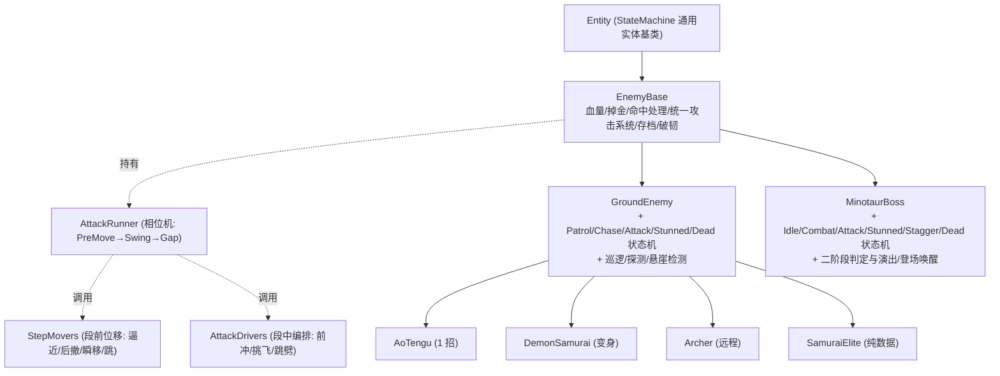

**关键取舍:Boss 不走 `GroundEnemy`,直接继承 `EnemyBase`**(`MinotaurBoss.cs:4`)。因为 `GroundEnemy` 里那套"巡逻踱步 / 撞墙掉头 / 脱战计时"对 Boss 完全是负担——Boss 待在自己的擂台里,开战即焊死。让它俩平级,谁都不用背对方的包袱。

代码位置:
- 核心层(小怪+Boss 共用):`Assets/Scripts/Enemy/EnemyBase.cs`、`AttackRunner.cs`、`StepMovers.cs`、`AttackDrivers.cs`
- 小怪:`Assets/Scripts/Enemy/Mobs/GroundEnemy.cs` + `Mobs/States/`
- Boss:`Assets/Scripts/Enemy/Boss/MinotaurBoss.cs` + `Boss/States/`

---

## 1. 敌人 AI 状态机

### 1.1 小怪状态机(GroundEnemy)

状态在 `GroundEnemy.Awake` 里构建并以 `patrolState` 为初态(`GroundEnemy.cs:82-92`)。共五态:

| 状态 | 文件 | 撑住的 anim bool | 职责 |
|---|---|---|---|
| **Patrol** 巡逻 | `Enemy_PatrolState.cs` | `isIdle` | 站一下 → 走一段 → 撞墙/悬崖/边界掉头 → 再站,循环踱步;`DetectPlayer()` 命中即转 Chase |
| **Chase** 交战 | `Enemy_ChaseState.cs` | `isIdle` | **战斗大脑**:维持战距、脱战计时、够条件就抽连段进攻 |
| **Attack** 攻击 | `Enemy_AttackState.cs` | (运行器设 `isAttacking`) | **薄壳**:只 `Begin/Tick/Cancel` 驱动统一运行器 |
| **Stunned** 硬直 | `Enemy_StunnedState.cs` | `isHit` | 破韧后的大硬直,可被处决;计时结束回 Chase/Patrol |
| **Dead** 死亡 | `Enemy_DeadState.cs` | `isDead` | 清速度、播死亡动画 |

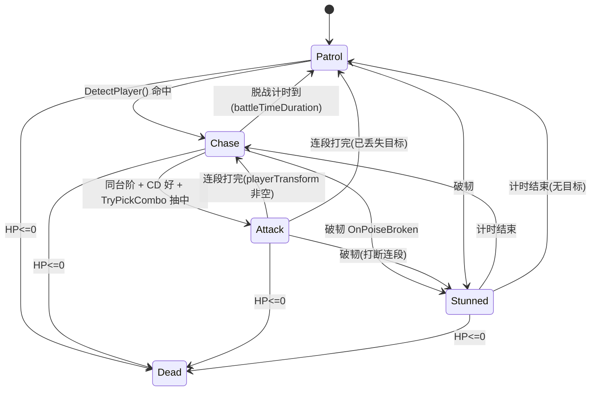

**设计意图逐条:**

- **合并 Idle+Move → 单个 Patrol**(`Enemy_PatrolState.cs:3`)。旧版拆成两个态,反复互切;现在合成一个"踱步"态,内部用 `pauseTimer` 切换"站/走",动画交给 Locomotion 混合树自动处理(见下)。少一次状态跳变,少一处 bug 面。
- **Chase 是唯一的战斗决策点**(`Enemy_ChaseState.cs:19-74`)。每帧顺序:①判脱战 ②面向玩家 ③`VerticalDistToPlayer <= attackVerticalTolerance && CD 好 && TryPickCombo(dist)` 就出手 ④否则按距离维持身位——太近(`< retreatDistance`)后撤半速、合适(`<= preferredCombatDistance`)站定等 CD、太远走近。把"打不打、站哪"全压在一处,读起来就是一段 if-else,不用在多个态之间追逻辑。
- **脱战靠"看得到且够得到"双条件**(`Enemy_ChaseState.cs:26-34`):`DetectPlayer()` 用横向矩形感知,再叠一条 `VerticalDistToPlayer <= chaseVerticalLimit`——高差过大(不同台阶)算够不到,计入脱战计时,超 `battleTimeDuration` 就 `LoseTarget()` 回巡逻。**为什么要高差判定?** 2D 平台里玩家常站在够不着的平台上,没有这条,小怪会永远"警戒"着一个它根本打不到的目标,显得很傻。

**小怪数值(代码默认值,每实例可在 Inspector 覆盖,`GroundEnemy.cs:8-38`):**

| 参数 | 默认 | 含义 |
|---|---|---|
| `patrolMoveSpeed` / `battleMoveSpeed` | 2 / 3.5 | 巡逻移速 / 战斗移速 |
| `patrolDistance` | 3 | 巡逻半径(以出生点为中心) |
| `preferredCombatDistance` / `retreatDistance` | 1.05 / 0.75 | 维持战距 / 贴太近后撤阈值 |
| `idleTime` | 1.5 | 巡逻站立喘息时长 |
| `battleTimeDuration` | 5 | 看不到玩家多久后脱战 |
| `stunDuration` | 3 | 破韧硬直时长 |
| `detectionRange` / `detectionHeight` | 6 / 3 | 横向探测框半宽 / 高 |
| `chaseVerticalLimit` / `attackVerticalTolerance` | 2.5 / 1.2 | 够得到高差 / 出手高差 |

### 1.2 Boss 状态机(MinotaurBoss)

Boss 六态,以 `idleState` 为初态(`MinotaurBoss.cs:64-72`):

| 状态 | 文件 | anim bool | 职责 |
|---|---|---|---|
| **Idle** | `Boss_IdleState.cs` | `isIdle` | 沉睡/待命站定;`combatEnabled` 且找到玩家即进 Combat |
| **Combat** | `Boss_CombatState.cs` | `isIdle` | **决策 hub**:面向 → CD 好抽连段就打 → 否则太远走近/够近站等 |
| **Attack** | `Boss_AttackState.cs` | (运行器设 `isAttacking`) | 薄壳,同小怪 |
| **Stunned** | `Boss_StunnedState.cs` | `isHit` | 破韧/处决硬直;二阶段更短 |
| **Stagger** | `Boss_StaggerState.cs` | `isHit` | 被识破后的短停顿(不破韧、不可处决) |
| **Dead** | `Boss_DeadState.cs` | `isDead` | 强播死亡 clip,收尾归 BossBattleManager |

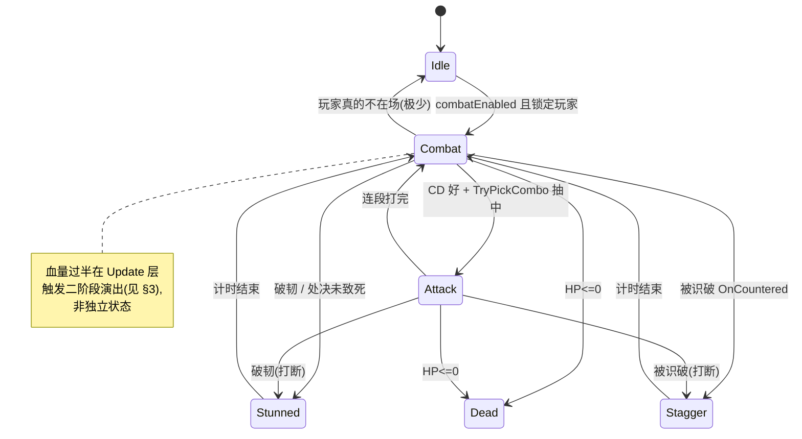

**设计意图逐条:**

- **三态合一 → Combat**(`Boss_CombatState.cs:3`):旧版拆成 Battle(决策 hub) / Chase(走近) / Wait(站等),三个态来回跳。现在合成一个,和小怪 Chase 同构。整个 Boss 战斗的"走位大脑"是这一个 `Update`,好读好调。
- **Boss 永不脱战**(`Boss_CombatState.cs:14` → `EnemyBase.KeepEngaged()`):不像小怪靠感知计时,Boss 一旦 `combatEnabled`,`KeepEngaged()` 用 tag 找到玩家就焊死,只有玩家真不在场(死亡/切场景)才回 Idle。**为什么?** Boss 战是"关门打狗"的仪式(雾门已封),脱战会破坏张力;玩家跑开只应导致 Boss 追,不应导致 Boss 放弃。
- **"打哪招"不由 Combat 决定,交给连段自己的 `range` gating**(`Boss_CombatState.cs:24`)。Combat 只负责"能不能打(CD)/该不该走近(`dist > MaxComboRange()`)",具体出哪套连段由抽签按距离/血量/权重决定。决策层和招式表解耦——加一套新连段不用动状态机。
- **破韧硬直 vs 识破踉跄,是两条不同的反应链**:
  - 玩家攒满削韧 → `OnPoiseBroken` → `Boss_StunnedState`(大硬直,`IsExecutable` 为真,可处决)。
  - 玩家识破一记红招 → `OnCountered` → `Boss_StaggerState`(`MinotaurBoss.cs:292`,短停顿 `staggerDuration=0.6s`,**不破韧、不可处决**,且 `ResetCombo()` 打断当前连段)。
  - **为什么分开?** 破韧是"长期投资到期"的大回报(可接处决大额伤害);识破是"单次精彩操作"的即时小回报(打断这一招 + 削一截韧性,把破韧提前)。两种正反馈节奏不同,不能混成一个态。
- **小怪被识破无反应是刻意的**:`EnemyBase.OnCountered()` 基类留空(`EnemyBase.cs:494`),只有 Boss override。小怪本来就脆,识破它们的红招免伤已经够了,不必再给一个踉跄窗口——把"识破 → 踉跄 → 处决"的完整博弈留给 Boss,维持规格差。

**Boss 数值(代码默认,`MinotaurBoss.cs:15-33`、各状态文件):**

| 参数 | 默认 | 含义 |
|---|---|---|
| `moveSpeed` | 2.2 | 一阶段移速 |
| `phase2SpeedBonus` | 1.2 | 二阶段移速倍率 |
| `staggerDuration` | 0.6 | 被识破停顿 |
| Stunned 时长 | 一阶段 3 / 二阶段 2 | `Boss_StunnedState.cs:13`,二阶段更短=更凶 |
| `executeStunDuration` | 1 | 被处决后的独立硬直(防连按 R) |

### 1.3 两条共用的底层约定(小怪与 Boss 一致)

- **攻击态是薄壳,命中/连段全在基类**:`Enemy_AttackState` 与 `Boss_AttackState` 都只是 `enemy.Attack.Begin()/Tick()/Cancel()`(`Enemy_AttackState.cs:9-26`、`Boss_AttackState.cs:10-28`)。**改攻击逻辑只动核心层,永远不用碰任何一个具体怪的状态机。**
- **Locomotion 混合树驱动 idle↔walk**:非攻击态只点亮一个撑场 bool(`isIdle`),真正走不走由 `Speed` 参数(水平速度)喂给混合树自动切(`EnemyBase.FeedLocomotionSpeed()`,子类 `Update` 末尾统一调,`GroundEnemy.cs:137` / `MinotaurBoss.cs:88`)。状态不再关心"现在该播 idle 还是 walk",只管设速度。
- **命中后必须"先硬直再击退"**(`EnemyBase.cs:425-433`,关键易错点):idle/move 每帧重设速度会盖掉击退,所以推人前先 `ctrl.Stun(stun)`(进不清速度的硬直态)再 `ApplyKnockback`,否则玩家纹丝不动。
- **`SetOnlyAnimBool` 一次只亮一个 bool**(`EnemyBase.cs:549`):遍历清所有 bool 只留目标,唯独 `isFlame`(变身持久标志)被排除,不参与互斥——保证受击/攻击/死亡这些"停留态"永远只有一个 bool 撑着 Animator,不会冻帧。

---

## 2. 敌人招式 / 意图如何复用第 3 章的攻击系统

> 攻击系统的三层数据模型(招 `EnemyAttack` / 连段 `EnemyCombo` / 段 `ComboStep`)、两个可插拔槽(段前 `StepMover` / 段中 `AttackDriverBase`)、运行器 `AttackRunner` 的 `PreMove→Swing→Gap` 相位机——完整规则见【第 3 章】。这里只讲**敌人 AI 怎么调用它、红/白招怎么接入格挡识破韧性、Boss/小怪如何用同一套表达出规格差**。

### 2.1 从"决策"到"出招"的接线

小怪 Chase 与 Boss Combat 里那句 `TryPickCombo(dist)`(`EnemyBase.cs:254`)是唯一入口:按"距离区间 + 血量区间 + 权重"抽一套连段,抽中就切攻击态、由运行器执行。**所有怪走的是同一句、同一个运行器。**

- **小怪"单招"也是连段**:哪怕像 `AoTengu` 只有一招,也在 Inspector 里配成一段(1 step)的 combo。统一入口,没有"单招特殊路径"。
- **`MaxComboRange()`** = 所有连段 `range.y` 的最大值(`EnemyBase.cs:244`),充当"出手/追击边界",取代了固定的 `attackRange` 字段。射程由招式表自己长出来,不用再单独维护一个数。

### 2.2 红招 / 白招 → 接入格挡·识破·韧性·处决(与第 3 章的交界)

命中统一走 `EnemyBase.ApplyHitToCollider`(`EnemyBase.cs:397`),它就是敌人侧与第 3 章战斗资源系统的**唯一交界**。剪刀石头布:

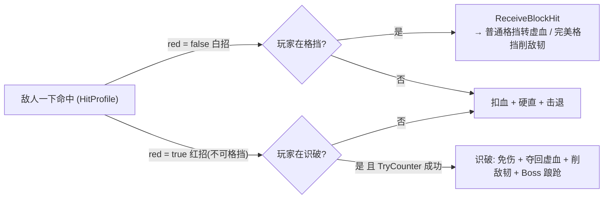

对应到本节需要说清的敌人侧语义:

- **红招 = 不可格挡 + 统一视觉**(`HitProfile.red`,`EnemyBase.cs:163`)。红招无视格挡,**只能用识破接**;识破随时可用(不看韧性),成功则免伤,并 `enemy.OnCountered()` 让 Boss 踉跄、`enemy.ApplyPoiseDamage(...)` 削一截韧性(`Player_CounterState.cs:67-68`),同时玩家夺回虚血(`RedeemGhostHP`)。红招统一走 `DangerTint`(橙红染色)+ `DangerScale`(放大 1.4×)(`EnemyBase.cs:225-226`),并用成对动画事件 `Warn`/`WarnEnd` 提前闪红预警(`EnemyAnimationEvents.cs:19-20`)。**统一视觉是硬约定**:玩家全程靠"变红变大 + 预警闪"识别"这一下必须识破",逐招手配颜色会造成语言不一致。
- **白招 = 可格挡**。玩家普通格挡 → `ReceiveBlockHit` 把伤害转成可回收的虚血;完美格挡窗口内 → 反震削敌韧(`Player_BlockState.cs:58`,`ApplyPoiseDamage(perfectBlockPoiseDamage)`)。这两条的虚血/窗口细节都在第 3 章,敌人侧只负责"这一下是不是白的"。
- **韧性 → 破防 → 处决**:玩家用完美格挡/识破攒满削韧 → `PoiseMeter` 归零 `OnPoiseBroken`(`Combat/PoiseMeter.cs:39`)→ 进硬直态,`IsExecutable`(`EnemyBase.cs:51`)为真 → 头顶浮处决提示,按 R → `enemy.OnExecuted(dmg)`。**小怪即死;Boss 不即死,只吃一笔大额伤害并再进硬直**(`MinotaurBoss.OnExecuted`,`MinotaurBoss.cs:302`)——处决对 Boss 是"阶段性重击",不是"秒杀键"。
- **韧性数值**(`PoiseMeter.cs`):`maxPoise=100`、脱战 `regenDelay=3s` 后按 `10/s` 回复。**每次削韧量**(`counterPoiseDamage` / `perfectBlockPoiseDamage`)配在 `PlayerStats` 上——【待填:识破削韧量、完美格挡削韧量,见第 3 章 PlayerStats】。

### 2.3 强制连段:开场与转阶段的"必放"编排

抽签之外有一条旁路:`ForceCombo(name)`(`EnemyBase.cs:240`)。`TryPickCombo` 每帧先看有没有强制连段,有就无视距离/权重直接放,用过即清(`EnemyBase.cs:259-266`)。用途:
- **Boss 登场首套**:`Activate()` 里 `ForceCombo("跳劈接大招")`(`MinotaurBoss.cs:261-265`)——一苏醒就以固定的高压连段开场,而不是随机站桩。
- **二阶段开场**:演出结束 `ForceCombo("二阶段开场")`(`MinotaurBoss.cs:194`)——闪到面前 → 挑飞接大招,给玩家一个"它变强了"的当头棒。

**为什么要强制而非调权重?** 开场/转阶段是编排好的"演出性"时刻,必须确定性发生;权重再高也可能抽不中,只有强制能保证"这一刻一定是这套"。

### 2.4 具体怪种:同一套表达出的差异化(全部零/极少代码)

| 怪 | 实现方式 | 要点 |
|---|---|---|
| **AoTengu** | 纯继承,空类(`AoTenguEnemy.cs`) | 1 招,clip 名恰好命中基类默认(idle/walk/attack/hit/death),一行不写 |
| **SamuraiElite** | 只覆盖 `MoveClip=>"run"`(`SamuraiEliteEnemy.cs:5`) | 近战三连 + 远程飞镖,**行为全在 Inspector 数据里**,代码只对 clip 名 |
| **Archer** | `ArcherEnemy.cs` | 远程:`Fire(i)` 走 `delivery=Ranged` 发射 `Arrow`;半血一次性后撤步(带无敌 i-frame);大招悬空零重力放箭 |
| **DemonSamurai** | `DemonSamuraiEnemy.cs` | 50% 血吼叫变身火焰形态:`ResolveClip` 给动作加 `_flame` 后缀 + 攻/速强化(`attackBuff=1.4`/`speedBuff=1.3`) |

**设计取舍——"血量触发的形态切换"用两种不同粒度实现:**
- `DemonSamurai` 的变身是**换皮 + 加 buff**(换 clip 后缀、乘攻速),用一个协程 + 一个 `transformed` 标志搞定(`DemonSamuraiEnemy.cs:34-53`),够用就好,没必要上状态机。
- Boss 的二阶段是**整场战斗节奏切换**(伤害/移速/演出/BGM),需要更重的机制(见 §3)。
- 两者都遵守同一条**复活幂等**纪律:`OnRespawn` 里 `StopAllCoroutines()` + `Attack.Cancel()` + 撤销 buff(`GroundEnemy.cs:147-156`、`DemonSamuraiEnemy.ResetForm`),否则读档后残留协程会叠成"永久烈焰"或把 `Invincible` 卡在 true。

**远程箭矢复用同一套命中**:`Arrow` 命中后回调 `owner.ApplyHitToCollider`(`Arrow.cs:60`),走的还是那套格挡/识破/击退——远程和近战对玩家的防御语言完全一致,而且箭会吸附跟随被击退的玩家,不留在原地穿帮。

---

## 3. 多阶段 Boss:过半进二阶段

### 3.1 触发与"阶段"如何表达

**触发在 Update 层轮询,而非独立状态**(`MinotaurBoss.CheckPhase2`,`MinotaurBoss.cs:110-123`):每帧检查 `CurrentHP/maxHP < phase2HPThreshold(0.5)` 且已开战、未死、未在二阶段,一旦满足就置 `IsPhase2=true`、收掉进行中连段、起演出协程。

**阶段差异用"数据覆盖 + 一个标志位"表达,不复制第二套状态机**:

```csharp
// MinotaurBoss.cs:50-51
public override float DamageMultiplier => IsPhase2 ? phase2AttackMultiplier : 1f;   // 二阶段加伤 ×1.5
public override float AttackMoveSpeed  => moveSpeed * (IsPhase2 ? phase2SpeedBonus : 1f);
```

- **伤害**:所有命中的伤害都乘 `DamageMultiplier`(`EnemyBase.DoFireHit` 里 `attack * DamageMultiplier * h.damageMultiplier`,`EnemyBase.cs:325`),二阶段 ×1.5,一处生效、全招覆盖。
- **速度**:走位与段前逼近都读 `AttackMoveSpeed`,二阶段 ×1.2。
- **硬直更短**:`Boss_StunnedState` 二阶段 2s(一阶段 3s),二阶段被打断后更快回身。

**招式的"阶段专属"不写在状态里,写在连段的 `hpPercent` 区间上**(`EnemyCombo.hpPercent`,`EnemyBase.cs:209`)。想让某套连段"只在残血放",把它的血量区间配成 `[0, 0.5]` 即可,`TryPickCombo` 的血量 gating 会自动只在二阶段抽到它(`EnemyBase.cs:274`)。

**这是本系统最关键的取舍——为什么不写"第二套状态机 / 第二个 Boss"?**
- 阶段之间**共用同一个 Combat/Attack 状态机**,只是"能抽到的招池 + 全局倍率"变了。一阶段和二阶段的走位、决策、破韧、识破逻辑 100% 复用,只有招池和数值不同。
- 复制一套状态机意味着两倍的维护面和两倍的 bug;而 `hpPercent` gating 让"加一招二阶段专属大招"退化成"在 Inspector 加一条 `[0,0.5]` 的连段",零代码、零状态迁移。
- 代价:所有阶段招都在同一个 `combos[]` 里,靠 gating 区分,配置列表会变长——用 `name`(如"二阶段开场")+ 血量区间保持可读即可接受。

**数值(`MinotaurBoss.cs:19-22`):** `phase2HPThreshold=0.5`、`phase2AttackMultiplier=1.5`、`phase2SpeedBonus=1.2`。具体每招的伤害/削韧/连段区间在 prefab Inspector——【待填:二阶段各连段的招表与数值】。

### 3.2 过渡演出:一段被精心保护的协程

`CheckPhase2` 命中后走 `Phase2TransitionRoutine`(`MinotaurBoss.cs:131-196`),时间线:

| 步 | 动作 | 关键处理 |
|---|---|---|
| 0 | 置 `PhaseTransition=true` + `Invincible=true` | 演出期间 `Update` 不跑战斗 FSM,改为每帧钉住站立(`MinotaurBoss.cs:84-85`) |
| 1 | 双方定身一拍 `phase2FreezeBeat=0.6s` | 冻玩家:清速度 + 回 idle + `simulated=false` |
| 2 | 吼开:吼叫音 + 顿帧 + 强震 + 全屏黑色放射(`ScreenRoarFx`)+ 把玩家吼飞 | 顿帧**自管 timeScale**(0.0001),**不能**走 `Hitstop.Do`(它的还原阈值 0.001 会把 timeScale 永久卡死);吼飞用逐帧衰减击退 `RoarKnockbackPlayer` |
| 3 | 蹲守蓄力 `phase2RoarHold=3s`:聚火花 + 充能音 | |
| 3.5 | 爆开:小顿帧 + 强震 + 爆炸粒子 + 染红淡入(`RageTintFadeIn`) | 染色走 `damageFeedback.SetBaseColor`,受击闪白后仍保持 |
| 3.6 | 切二阶段 BGM(boss2)+ 强化吼,吼完才解冻 | |
| 5 | `RestorePhase2State()` 复原 → `ForceCombo("二阶段开场")` → 回 Combat | 强制第一套"闪到面前→挑飞接大招" |

**设计取舍——"演出"和"战斗"必须彻底隔离**:二阶段过渡不是一个战斗状态,而是一段接管全场(玩家物理、timeScale、血条、无敌)的协程。为此:
- **专门抽出 `RestorePhase2State()`(`MinotaurBoss.cs:200-211`)负责幂等复原**——正常结束调它,`OnDisable`(切场景/死亡)异常中断也调它(`MinotaurBoss.cs:253-258`)。因为演出中途若被打断,玩家可能永远卡在 `simulated=false`(软锁),必须有兜底把 timeScale/物理/血条/无敌全部还原。
- **`OnRespawn` 要 `StopAllCoroutines()` + `Attack.Cancel()`**(`MinotaurBoss.cs:272-284`):清掉读档前残留的染色/击退协程,并显式 `Anim.Play("Locomotion")`——攻击 clip 是 `Anim.Play` 强进的,只靠 `SetBool` 切不回来。

---

## 4. Boss 登场与击破演出的挂钩

编排层在 `Assets/Scripts/BossFight/`,不写战斗逻辑,只做"一场 Boss 战的开场—封锁—结束"的导演。核心一头一尾:登场 `BossIntroTrigger`、收尾 `BossBattleManager → BossFinishUI`。

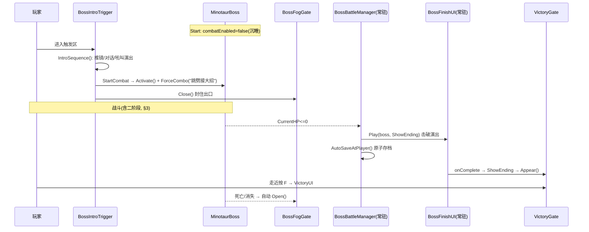

### 4.1 登场:靠 vcam 优先级 blend,不硬切相机

`BossIntroTrigger.IntroSequence()`(`BossIntroTrigger.cs:92-179`)的时间线:进场冻结玩家(`simulated=false`)→ 抬高一台预摆的低优先级 `bossIntroVcam` 的 `Priority` 到 100,让 Cinemachine 自己平滑 blend 推镜(**不手动接管 Brain、不直接 set 相机 transform**,避免冷启动硬切突跳)→ 对话(`timeScale=0`)→ 吼叫高潮(名牌扫入 / 血条充满 / 震屏 / zoom 抖 / 全屏放射)→ 降回 vcam 优先级混合回玩家镜头 → `StartCombat()`。

**与战斗侧的挂钩点就一处:`StartCombat()`(`BossIntroTrigger.cs:204-215`)**——解冻玩家 → `boss.Activate()`(把 `combatEnabled` 置 true 并 `ForceCombo` 首套)→ `fogGate.Close()` 封门 → 起 Boss BGM。`Activate` 是虚方法(`EnemyBase.cs:18`),所以登场器不绑定具体 Boss 类型,任何 `EnemyBase` 都能被它唤醒。

**易错点——Boss 默认沉睡**:普通怪 `combatEnabled=true`,Boss 在 `IntroTrigger.Start` 被睡掉(`BossIntroTrigger.cs:38`),只有走到 `StartCombat` 才醒。若发现"Boss 进场不动",先查登场流程是否走到了 `StartCombat`。

**演出期全局开关 `BossIntroTrigger.Sequencing`**(静态)被 `PlayerInput` / `PauseMenu` / `CharacterPanelUI` 读取,用于演出期间屏蔽输入、禁暂停、禁开面板。

### 4.2 雾门:类暗魂的"关门打狗"

`BossFogGate`(`BossFogGate.cs`)开战 `Close()`(启用挡路碰撞 + 雾墙淡入),`Update` 里持续看护——一旦 Boss 为 null / 失活 / `CurrentHP<=0` 就自动 `Open()`(`BossFogGate.cs:36`)。淡入淡出用 `Time.unscaledDeltaTime`,因为演出常把 timeScale 改了。姊妹脚本 `EnemyClearGate` 同构但触发源不同(一房小怪全死),用于精英怪封锁房。

### 4.3 击破:常驻协调器 + 击破演出

**`BossBattleManager` 是 Bootstrap 里的跨场景常驻单例**(`BossBattleManager.cs:10`),每次场景加载/读档后自动按 `isBoss` 找本场景 Boss、`WatchBoss` 监测死亡(`BossBattleManager.cs:75-84`)。**为什么常驻而非每场景手挂?** 省掉"每个战斗场景都要手动挂脚本 + 连 Boss 引用"的重复劳动和漏配风险——它自己会找。

Boss"战斗中被打死"(对象还在 + HP≤0 + 仍激活,借此和"读档把 Boss 还原成已击败"区分)触发 `OnBossDefeated`(`BossBattleManager.cs:86-97`):
1. `AutoSaveAtPlayer()` 原子写档——把"Boss 已死 + 背包/装备/金币"一起落盘,杜绝"Boss 死了但掉落没了"的 desync。
2. `BossFinishUI.Play(boss, ShowEnding)` 播击破演出,完成后回调 `ShowEnding` → `VictoryGate.Appear()`(玩家走近按 F 才通关)。

**`BossFinishUI` 击破演出**(`UI/BossFinishUI.cs`,同为 Bootstrap 常驻):顿帧白闪 → 慢放 → 全屏压暗盖住世界 → Boss 变白色剪影 + 水墨泼溅 + 碎屑迸发 → 击破名牌浮现 → 剪影与泼溅同步淡散 → 露出场景。**关键细节:演出把 timeScale 压到≈0,于是死亡动画的 Animator 被切成 `UnscaledTime` 播放**(`BossFinishUI.cs:99`),否则剪影会定格在接近站立的早期帧。Boss 死亡态本身不做事(`Boss_DeadState.cs`),"何时消失"交给演出末尾 `SetActive(false)`——所有 Boss 击败都经这条演出路径,不会裸切死亡动画。

**易错点——中途切场景强制收尾**:`BossFinishUI.OnSceneChanged`(`BossFinishUI.cs:62`)在演出中途切场景时强制还原 timeScale/材质/HUD,避免卡死。

### 4.4 读档一致性:四个门都双向重判

登场器、雾门、清场门、通关门**全部订阅 `SaveSystem.AfterApply`**,在场景态恢复后**双向**重判(开/关都判,不是"读档只负责开门"):
- `BossIntroTrigger.OnSaveApplied`:Boss 被还原为存活 → 重置 `played=false` + 重新沉睡 + 藏血条,让登场能再触发;Boss 已死 → `played=true` 永不再演。
- `VictoryGate.OnSaveApplied`:场上有存活 Boss → `Hide()`(防不打 Boss 直接通关);无存活 Boss → `Appear()`(防死 Boss 无门卡死)。

**为什么双向?** 读"杀 Boss 前的旧档"必须让雾门/通关门正确回到封锁态,否则状态会泄漏成"已开门/已通关"。这是编排层与存档系统对齐的核心纪律。

---

## 5. 本节设计取舍小结

| 取舍 | 选择 | 理由 |
|---|---|---|
| 小怪与 Boss 的关系 | 共用 `EnemyBase` 攻击底座,只在 AI 层分叉 | 新怪/新招零到极少代码;Boss 只是"配置更豪华的敌人" |
| Boss 继承链 | 直接继承 `EnemyBase`,不走 `GroundEnemy` | 巡逻/脱战对擂台 Boss 是负担 |
| 多个决策态 | 合并为单个 Chase / Combat | 战斗大脑集中一处,好读好调,少状态跳变 |
| 二阶段 | 数据覆盖(`DamageMultiplier`/`hpPercent` gating)+ 一个标志位 | 不复制第二套状态机/第二个 Boss,共用全部战斗逻辑 |
| 二阶段过渡 | Update 层协程 + 幂等 `RestorePhase2State` | 演出与战斗彻底隔离,异常中断有兜底防软锁 |
| 破韧硬直 vs 识破踉跄 | 两条独立反应链;小怪无踉跄 | 长期投资 vs 单次操作,正反馈节奏不同;维持规格差 |
| 处决对 Boss | 不即死,大额伤害 + 再硬直 | 处决是阶段性重击,不是秒杀键 |
| Boss 编排协调器 | Bootstrap 常驻单例自动接管 | 免每场景手挂/漏配;跨读档自动重接 |
| 门禁读档一致性 | 四个门订阅 `AfterApply` 双向重判 | 防状态泄漏成"已通关/已开门" |

---

### 待作者补充的具体数值
- 识破削韧量 `counterPoiseDamage`、完美格挡削韧量 `perfectBlockPoiseDamage`(在 `PlayerStats`,见第 3 章)
- 处决对 Boss 的扣血量(`Player_ExecuteState` 传入 `OnExecuted` 的 dmg)
- 各怪 `maxHP`/`attack`/`goldDrop` 与每招 `HitProfile`(伤害倍率/击退/红白)、每套连段的 `range`/`hpPercent`/`weight`——这些在场景 prefab 的 Inspector,非代码默认值
- 二阶段各连段的招表与具体数值

---

# 存档 / 重生架构

> 本节讲清楚一件事:一个「过场景不丢进度、死亡要回滚、火堆存档、永久死亡的 Boss 不复活」的类魂存档循环,到底该怎么切数据、怎么组织重生流程,以及一个把玩家卡成"幽灵"的物理态泄漏 Bug 是怎么来的、怎么修的。

---

## 一、核心设计:全局态 vs 场景态分离

### 1.1 设计意图 —— 一对天然矛盾

类魂存档要同时满足两组互相打架的需求:

| 需求 | 例子 | 想要的行为 |
|---|---|---|
| **进度不能丢** | 玩家的血量、金币、背包、装备、学到的技能 | 过一道门切到下个场景,这些**必须原样带过去**,一点不重置 |
| **世界要能回滚 / 重刷** | 场景里的杂兵、开过的门、商店库存 | 死亡 / 读档时**回到存档那一刻**;普通杂兵每次进场景**都刷新** |

如果把所有状态一视同仁地"每次进场景都从存档覆盖",玩家一过门血量就被打回存档值,进度就丢了;如果都"绝不覆盖",那死亡又回滚不了世界。矛盾的根源是:**这两类状态的生命周期不一样**。

### 1.2 规则:按"东西挂在谁身上"切两半

系统把所有可存档状态切成两层,判据是**它的载体是不是跨场景常驻**:

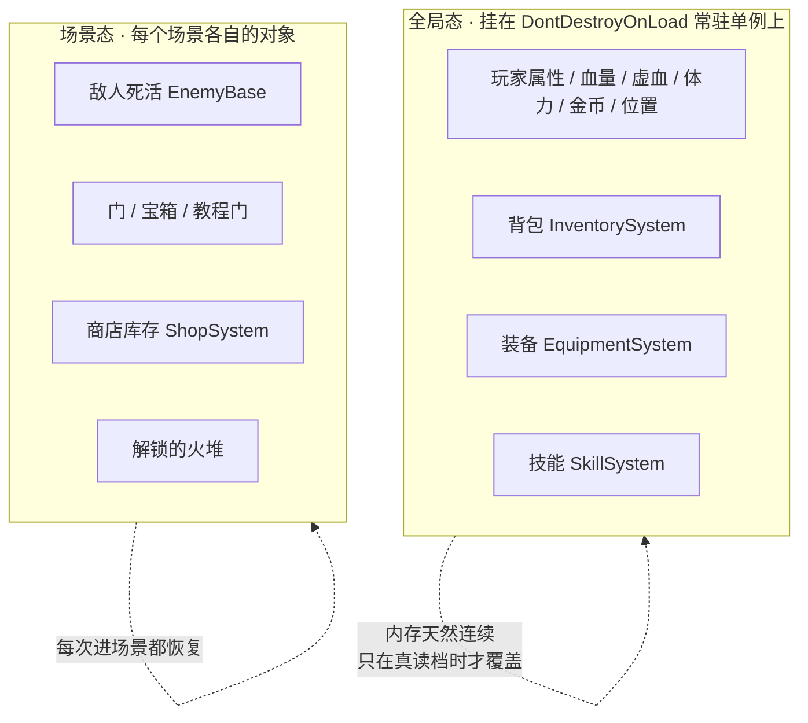

- **全局态**(`ApplyGlobalState`,`SaveSystem.cs:253`):玩家属性 / 血量 / 位置 + 背包 / 装备 / 技能。这些挂在 `DontDestroyOnLoad` 常驻单例上,**内存天然连续**——过门根本不需要"存了再读",对象就没被销毁过。所以**只在「首次进入 / 显式读档 / 死亡重生」时 apply 一次**,普通过门切场景**绝不覆盖**。
- **场景态**(`ApplySceneState`,`SaveSystem.cs:313`):每个场景里的敌人 / 门 / 商店 / 火堆,**每次进场景都恢复**——因为这些对象随旧场景一起被销毁了,进新场景是全新实例,必须按存档 / 内存集合重建它们的开关死活。

### 1.3 实现:一个 `globalStateLoaded` 标志撑起整套语义

两层的开关全靠一个布尔标志 `globalStateLoaded`(`SaveSystem.cs:204`)驱动,它区分了"真读档"和"普通过门":

```csharp
// SaveSystem.cs:228 —— 每个场景加载后由 SaveSystem 自己触发
public bool ApplyOnSceneLoaded()
{
    var data = Load();
    if (data == null) return false;

    // 真读档(继续/重生/手动读档后切场景)= globalStateLoaded 尚未确立;普通过门切场景则已确立。
    bool realLoad = !globalStateLoaded;
    if (realLoad)
    {
        ApplyGlobalState(data);   // 只有真读档才回滚玩家/背包/装备/技能
        globalStateLoaded = true;
    }
    ApplySceneState(data, realLoad);   // 场景态每次都恢复,realLoad 决定要不要清内存集合
    return true;
}
```

`realLoad` 这个语义一路贯穿到场景态恢复,决定**要不要清空并重建两个内存集合**——已击败的永久死亡怪 `runtimeDefeatedEnemyIDs`、已开的门 `runtimeOpenedDoorIDs`(`SaveSystem.cs:87-88`):

- **真读档**(`realLoad=true`):清空集合 → 从存档重建 → 敌人死活 / 门开关**回到存档状态**(`ApplyEnemyStates`/`ApplyDoorStates`,`SaveSystem.cs:671`、`696`)。
- **普通过门**(`realLoad=false`):**保留**这两个内存集合(和背包一样内存连续)→ 杀过的精英、开过的宝箱**过场景不复活、回来不重刷**,堵死了"来回跳场景刷宝箱 / 刷精英"的漏洞。

> **为什么用一个会话内的内存集合、而不是每次杀怪就落盘?** 这是关键取舍。类魂的惯例是"清一次算数、但不存档就当没清"。所以杀怪 / 开门时**只改内存集合、不落盘**(`MarkEnemyDefeated`/`MarkDoorOpened`,`SaveSystem.cs:458`、`466`),真正落盘只发生在"存档那一刻"的快照(`CaptureEnemyStates`,`SaveSystem.cs:504`)。这样"杀了精英但没坐火堆就死了" → 读档时精英复活、要重打,完全符合类魂手感,而且省掉了海量零碎的磁盘写。

### 1.4 一个易踩的坑:装备加成不能被存进"裸值"

`BuildSaveData` 存的是玩家的**基础三围裸值**,存之前先把装备加成扣掉(`SaveSystem.cs:159`):

```csharp
float baseMaxHP = stats.maxHP - (equipment != null ? equipment.GetEquippedMaxHPBonus() : 0f);
```

如果直接存 `stats.maxHP`(已含装备加成),读档时装备系统又会**再叠一次**加成 → 每次读档血上限就虚高一截。存裸值、读档时由装备系统重新叠,才能幂等。

---

## 二、常驻玩家 + 篝火存档点重生流程

### 2.1 常驻玩家:数据"天然不丢"的物理基础

全局态之所以能"内存连续",前提是**玩家对象跨场景不销毁**。`PlayerController` 是 `DontDestroyOnLoad` 单例(`PlayerController.cs:9`、`103-114`),配合三条清理规则:

- **重复实例自毁**:新场景若又摆了个玩家预制,常驻玩家会被挪到这个出生点、然后把新实例自毁(`PlayerController.cs:105-112`)——保证全程只有一个玩家,数据不分叉。
- **回非游玩场景就销毁**:回主菜单 / Bootstrap 时销毁常驻玩家(`OnSceneLoadedCleanup`,`PlayerController.cs:160-165`),保证下次开局是全新状态。
- **带死亡态进新场景 → 自动复活**:重生 / 读档时若玩家还停在死亡态,`OnSceneLoadedCleanup` 会调 `Revive()`(`PlayerController.cs:164`)。

> 存读档中枢 `SaveSystem` / `CheckpointManager` 同样是摆在 Bootstrap 场景的常驻单例(`SaveSystem.cs:90`、`CheckpointManager.cs:17`)——常驻单例统一进 Bootstrap,不靠 Resources 另起自动创建。

### 2.2 坐火堆:一次交互干四件事

营火交互 `CheckpointTrigger`(继承通用 `InteractTrigger`)玩家进范围按 F,把带 `respawnAnchor` 的精确复活落点传给 `CheckpointManager.ActivateCheckpoint`(`CheckpointTrigger.cs:20-24`)。这个入口原子地做四件事(`CheckpointManager.cs:25-60`):

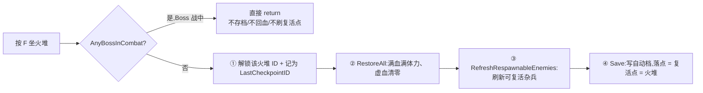

设计要点:
- **落点 = 复活点 = 火堆**(`CheckpointManager.cs:54-55` → `SaveSystem.Save`,`SaveSystem.cs:132`)。存档时 `landPosition` 和 `respawnPosition` 都是火堆点。
- **复活落点优先用设计师摆的锚点**(`respawnAnchor`),没有才退回"玩家站立位置 + 右偏移 `(1,0)`"(`CheckpointManager.cs:54`、`respawnOffset` 默认 `(1,0)`)——避免复活时和火堆碰撞体重叠卡住。
- **Boss 战期间禁用火堆**(`CheckpointManager.cs:27`,`EnemyBase.AnyBossInCombat()`)——不让玩家中途存进一个半血 Boss 的死局。

### 2.3 自动档只在 4 处写盘

自动档(`save_auto.json`,唯一自动档,`SaveSystem.cs:84`)刻意只在四个时机落盘,其余时间只改内存:

| # | 时机 | 入口 | 为什么 |
|---|---|---|---|
| 1 | **坐火堆** | `CheckpointManager.ActivateCheckpoint → Save` | 常规存档点 |
| 2 | **新游戏首存** | 进首关后 `AutoSaveAtPlayer`(`SaveSystem.cs:125-129`) | 让"继续"立刻可用、退出不丢新局 |
| 3 | **手动读档后镜像** | `LoadSlot` 里 `WriteSlot(AutoSlot, 所读档)`(`SaveSystem.cs:406`) | 复活点跟着所读的档走 |
| 4 | **击破 Boss** | `BossBattleManager.OnBossDefeated → AutoSaveAtPlayer` | 把"Boss 已死 + 当前掉落"**原子写**进自动档,杜绝"Boss 死了但掉落没了"的 desync |

> 另有 3 个**手动槽**(`save_0/1/2.json` + 同名 `.png` 缩略图,`SaveSystem.cs:81-85`),由 ESC 菜单随时写,带现截缩略图(`MakeThumbnail`,缩到 320px 宽,`SaveSystem.cs:431-447`)。

### 2.4 三条读档路径

读档不是一件事,而是三条语义不同的路径,全靠 `globalStateLoaded` / `nextLoadIsRespawn` 两个标志区分:

| 路径 | 触发 | 落点 | 血量 | 关键调用 |
|---|---|---|---|---|
| **死亡重生** | 非教程场景死亡 | `respawnX/Y`(火堆) | **强制满血、虚血清零** | `PrepareRespawn()`(`SaveSystem.cs:250`) |
| **主菜单继续** | 主菜单 Continue | `playerX/Y`(读档落点) | 读存档血量 | `RequestFullReload()`(`SaveSystem.cs:246`) |
| **手动读档** | ESC 读某槽 | 存档落点 | 读存档血量 | `LoadSlot`(`SaveSystem.cs:401`) |

死亡重生分支最要命的一条规则(`SaveSystem.cs:301-308`):

```csharp
if (isRespawn)
    stats.LoadSavedVitals(stats.maxHP, 0f, stats.maxStamina, data.gold);   // 满血满体力、虚血清零
else
    stats.LoadSavedVitals(data.currentHP, data.currentGhostHP, data.currentStamina, data.gold);
```

> **绝不能读死亡瞬间存档里的 0 血**,否则会出现 `Die → Revive` 之后"空血站着"的荒诞局面。死亡重生一律满血回火堆,这是写过的坑(`SaveSystem.cs:303` 注释即为此)。

### 2.5 死亡重生总调度

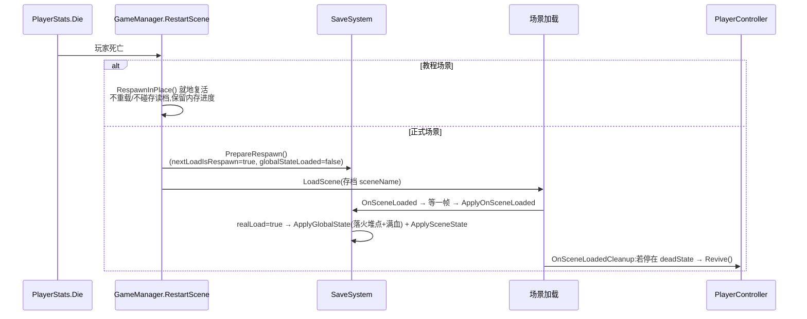

- **教程是特例**:教程内死亡 = **原地复活**(`GameManager.RespawnInPlace`,`GameManager.cs:64-78`),不重载、不碰存读档,开过的门 / 已过的站在内存里原样保留,玩家不走回头路。这条早 return 很隐蔽,改重生逻辑时容易误伤(`GameManager.cs:48`)。
- `RespawnInPlace` 里复活杂兵的口径,必须和 `SaveSystem.RefreshRespawnableEnemies` 完全一致——**只复活非永久死亡的怪**(`RespawnsAtCheckpoint`),永久死亡的练习怪保持当前态(`GameManager.cs:74-75` vs `SaveSystem.cs:330-339`)。两边要同步改,否则会出现"该死的复活了 / 该复活的没复活"。

---

## 三、一个真实 bug 的复盘:状态泄漏,与"物理态安全网"

> **它不是本项目的技术难点**(只是个小 bug),但它很好地印证了 §一 那套"读档必回滚到基线"的架构价值,所以留作复盘 —— 真正的难点在 §一,不在这个补丁。

**现象**:玩家被 Boss 挑到空中(此时刚体临时从 `Dynamic` 切成 `Kinematic`、由 Boss 精确控位移)时**打死 Boss**,再**读一个更早的存档** → 玩家**无重力、穿墙、跳不停**,像个幽灵。

**根因(两层叠加,经典的"获取没配对释放 + 恢复不彻底")**:

1. **生产者没配对释放**:Boss 在挑飞中途被打死,那条死亡路径没走到 `LaunchDriver.End()` → 配对的 `EndLift()`(把刚体还原 `Dynamic`)被跳过,玩家停在 `Kinematic + IsLifted=true`。
2. **消费者恢复不彻底**:读档 / 复活本该是"把玩家拉回干净基线"的最后一道防线,但 `Revive()` 当时**只复位了 `simulated`,漏了 `bodyType` 和 `IsLifted`** → 上一段泄漏的 Kinematic 态穿透了整个读档流程。

**修复(双保险,两头都幂等)**:

- **(A) 生产者侧**:让 Boss 死亡统一走状态机 `deadState` → `Boss_AttackState.Exit` 调 `Attack.Cancel()` → `AttackRunner.Cancel` → `LaunchDriver.End` 里 `target.EndLift()`,保证"Boss 中途死"也能走到配对释放("谁申请谁释放")。
- **(B) 消费者侧**:把 `bodyType` / `IsLifted` 正式补进读档 / 复活的"**物理态复原基线**"(无条件复位成 `Dynamic + simulated + 速度归零 + IsLifted=false`)。项目里 `simulated` 早有这张安全网——Boss 登场冻结玩家 `simulated=false`,就靠 `BossIntroTrigger.OnDisable` 兜底解冻——挑飞新引入的 `bodyType` 只是**漏了入网**。

**真正的价值不在这个补丁,在 §一**:一旦"真读档 = 无条件回滚到快照基线"作为**架构**立住,这一整类"上一段玩法泄漏的临时态穿透读档"的幽灵 bug,就从**结构上**被收掉,而不是逐个去堵。这也是我把它从"技术难点"改标成"复盘"的原因——**能修 bug 是基本功,能用架构让一类 bug 不再发生才是设计能力**。

> *代码:`PlayerController.cs:206-224`(BeginLift/EndLift)、`:168-173`(Revive 复原基线)、`AttackDrivers.cs:128`(LaunchDriver.End 配对释放)*

---

## 四、本节设计取舍小结

| 取舍 | 选择 | 代价 / 收益 |
|---|---|---|
| 状态分层 | 按"载体是否常驻单例"切全局态 / 场景态 | 一个 `globalStateLoaded` 标志解决"过场景不丢 vs 死亡回滚"的矛盾;代价是这个标志的时序很敏感,改动要想清 `realLoad` 取值 |
| 何时落盘 | 只在 4 处写自动档,平时只改内存集合 | 省盘写、契合类魂"不存档就当没清"手感;代价是"杀了精英没坐火堆就死会复活"必须作为**有意行为**沟通清楚 |
| 永久死亡 Boss | 击破即触发完整 autosave 原子落盘 | "杀过的 Boss 不重打" + 掉落不 desync;精英因无此层 autosave 而保留"读档复活",这是刻意的分级 |
| 物理态泄漏 | 生产者配对释放 + 消费者幂等兜底 | 双保险抗异常路径;代价是每新增"临时改玩家物理量"的机制,都得记得同步进复原基线 |

---

# 反馈 / 手感框架 与 工程架构总览

> 本节口径:先讲"为什么"(设计意图与取舍),再落到规则 / 数值 / 实现(状态机、架构、关键代码)。所有数值与实现均以代码为准并标注 `file:line`;拿不准的战斗平衡数值(削韧量 / 窗口时长等)不在本节范围,故不臆造。
>
> ⚠️ 校准说明:文档 `代码导览/08-Feedback` 描述的受击闪白仍是**旧版"换材质 + RestoreMaterials + warningHeld"**方案;当前代码 `DamageFeedback.cs` 已重写为 **MaterialPropertyBlock + HitFlash Shader** 方案(见下文 4.4),本节按代码为准。建议回头同步该文档。

---

## 一、反馈 / 手感框架(Juice Layer)

### 1.1 设计意图:把"手感"做成一层可复用的服务

动作游戏的"打击感 / juice"由一堆细碎表现拼出来——命中白闪、顿帧、震屏、粒子火花、击退滑行、破防慢镜。它们的共同特征是:**与游戏逻辑无关、被大量不同系统在不同时机触发、每次调用参数不同**。如果散落在各个状态里现写(每次 `new` 一个粒子、每次改 `Time.timeScale`、每次手动改材质颜色),会有三个必然的坑:

1. **重复分配**:每帧受击就 `new` 一个 MaterialPropertyBlock / Instantiate 一个粒子 → GC 抖动。
2. **状态互相踩踏**:多个系统同时写 `Time.timeScale`(顿帧 vs 暂停菜单 vs boss 演出),彼此把对方的值还原掉。
3. **散点难调**:美术想加一个火花、策划想调震屏强度,得改代码。

因此本项目把反馈抽成**一层与逻辑解耦的"反馈供给方"**:调用方只管在正确时机喊一句"打到了 / 被打了 / boss 怒了",反馈层负责把它翻译成肉眼 / 手感可感知的表现。它**不做任何伤害判定**。

### 1.2 架构总览:一份有状态组件 + 一组无状态单例

反馈层脚本都在 `Assets/Scripts/Feedback/`,按"是否有每实例状态"分成两类,这是最核心的一条工程取舍:

| 组件 | 生命周期 | 职责 | 关键调用 |
| --- | --- | --- | --- |
| `DamageFeedback` | **挂在 prefab 上**(玩家 / 每个敌人 / boss 各一份) | 受击闪白 + 预警红染 + 击退滑行 + 底色染色 | `GetComponent<DamageFeedback>()` |
| `Hitstop` | 懒加载常驻单例 | 顿帧(压 `Time.timeScale`) | `Hitstop.Do(d, scale)`(静态) |
| `CameraShake` | 常驻单例(Bootstrap) | 震屏(Cinemachine Impulse) | `CameraShake.Shake(d, mag)`(静态) |
| `VfxManager` | 常驻单例 + 对象池 | 通用粒子播放 / 回收 | `VfxManager.Play/PlayLoop/StopLoop`(静态) |
| `ScreenRoarFx` | 常驻单例(Bootstrap) | 全屏放射状吼叫(集中线) | `ScreenRoarFx.Burst(...)`(静态) |
| `BossFinishUI` | 常驻单例(Bootstrap) | boss 击破演出(慢镜 + 剪影 + 泼溅) | `BossFinishUI.Instance.Play(boss, cb)` |

**为什么这样分:** 受击表现天然是"每个角色一份状态"(这个怪现在闪没闪、红没红、往哪滑),做成挂载组件最自然;而顿帧 / 震屏 / 粒子是"全局只需要一个执行器"的无状态工具,做成**静态入口 + 懒加载单例**,调用方一行 `Hitstop.Do()` 即可,不必在每个场景里摆、也不必持引用。

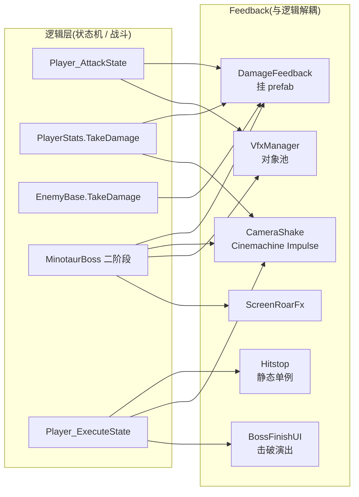

---

### 1.3 顿帧 Hitstop:压时间,但要和暂停"抢时间"

**设计意图:** 重击命中的一瞬把世界几乎冻住一小会儿,给出"咔哒"一下的冲击手感。

**规则与数值:** `Hitstop.Do(duration=0.1f, scale=0.04f)`(`Hitstop.cs:18`)把 `Time.timeScale` 压到 `scale` 并保持 `duration`(用 **realtime 计时**,否则被自己压慢的时间会把等待也拖长)。处决重击用更重的 `Do(0.25f, 0.04f)`(`Player_ExecuteState.cs:60`)。

**实现取舍——顿帧 vs 暂停的 `timeScale` 之争(本组件最见功力的一段):**

```csharp
IEnumerator Run(float d, float scale)
{
    if (Time.timeScale <= 0.001f) yield break;   // 已经暂停(弹窗/商店)就不顿
    busy = true;
    float prev = Time.timeScale;
    Time.timeScale = scale;
    yield return new WaitForSecondsRealtime(Mathf.Max(0.02f, d));
    // 还原前确认 timeScale 还停在"我们设的顿帧值附近";被暂停成 0 或被别的系统改过都不碰
    if (Time.timeScale > 0.001f && Time.timeScale <= scale + 0.001f) Time.timeScale = prev;
    busy = false;
}
```

`Time.timeScale` 是全局单例资源,谁都能写。顿帧期间玩家若开了暂停菜单(把 `timeScale` 设成 0),顿帧结束时若无脑还原成 `prev=1`,就会把暂停解掉。所以起手判"已暂停就不顿"(`:26`),还原前再判"值是否仍是我压下去的那个"(`:33`)——**任何多方写同一个全局量的系统,都必须假设中途会被别人改过**。`busy` 保证同一时刻只有一次顿帧在跑。

---

### 1.4 震屏 CameraShake:走 Cinemachine Impulse,不直接动相机

**设计意图:** 受击 / 格挡 / 识破 / 处决 / boss 演出都要"镜头一震";但项目相机由 Cinemachine 跟随玩家,直接改相机 transform 会和跟随 blend 打架。

**实现:** `CameraShake` 是自带 `CinemachineImpulseSource` 的常驻单例(`CameraShake.cs:7` `[RequireComponent]`)。`Awake` 里把 Impulse 定型为 **Rumble(抖动感而非单向推)+ Uniform(不随距离衰减)**(`:22-25`);`Shake(duration, magnitude)`(`:29`)每次给一个**随机四象限方向**再 `GenerateImpulseWithForce`(`:39-42`),避免每次都同向:

```csharp
float sx = Random.value < 0.5f ? -1f : 1f;
float sy = Random.value < 0.5f ? -1f : 1f;
s.source.DefaultVelocity = new Vector3(Random.Range(0.6f,1f)*sx, Random.Range(0.6f,1f)*sy, 0f);
s.source.GenerateImpulseWithForce(magnitude * s.forceScale);
```

**为什么用 Impulse:** 震屏被"发射源 → 监听器"解耦——场景里的 gameplay vcam 挂 `CinemachineImpulseListener` 接收,相机跟随逻辑与震屏各管各的,不会互相破坏。**生效前提**:vcam 上必须有 Listener,否则调用是静默空操作(项目已在各场景 vcam 配好)。数值上受击 / 格挡用小值(默认 `0.12s / 0.4`),处决 `Shake(0.3f, 0.9f)`(`Player_ExecuteState.cs:59`)、boss 爆炸 `Shake(1f, 0.35f)`(`MinotaurBoss.cs:182`)用大值。

---

### 1.5 对象池特效 VfxManager:加特效 = 做个预制 + 一行调用

**设计意图:** 粒子特效用量大、频繁生成销毁,`Instantiate/Destroy` 是 GC 与卡顿大户;且希望"美术加新特效不写脚本"。

**规则:** 特效做成 `Resources/` 下的 `ParticleSystem` 预制,调用方只用两组静态入口:
- `Play(key, pos, rot, scale, tint, sortRef)`(`VfxManager.cs:24`)——一次性,播完自动回收。
- `PlayLoop(...)` + `StopLoop(handle)`(`:40`/`:54`)——跟随父物体的持续特效,手动停。

**实现要点(三个"为什么"):**

1. **对象池而非反复 Instantiate:** `Rent`(`:111`)先翻池里有没有活的实例复用,没有才 `Instantiate`;`Recycle`(`:138`)定时回池、`RecycleWhenDead`(`:144`)等持续特效粒子自然消散后回池。首帧只付一次实例化成本,之后零分配。
2. **tint 是"相乘"不是"覆盖":** 首次实例化时记下每个子粒子系统的预制原色 `baseColors`(`:120-123`),之后 `m.startColor = baseC * tint`(`:83`)。传 `Color.white` = 保持原色;传具体色才染色。**关键**:从池复用时永远基于原色重算,不会被上一次的 tint 污染。
3. **排序跟随角色:** `sortRef` 传一个角色的 `SpriteRenderer`,特效排序层 = 角色层 `+30`(`:86-90`),保证火花永远盖在角色之上。

```csharp
m.startColor = baseC * tint;   // :83 在预制原色上相乘(白=保持原色)
r.sortingOrder = sortRef.sortingOrder + 30;   // :90 特效压在角色之上
```

> 少数"用量小、参数每次不同"的临时特效(月牙刀光 `Vfx_SlashLine`、残影 `Vfx_Afterimage`、尘土 `SpriteOneShot`)刻意**不进池**——自建 GameObject、跑完渐隐就 `Destroy`。池化是为高频复用服务的,一次性低频特效池化反而是过度设计。

---

### 1.6 受击闪白 DamageFeedback:MPB + Shader,把"每次 new"消灭掉 ⭐

这是"框架化、不每次 new"最典型的一块,也是从旧方案演进来的重点。

**旧方案的问题(已废弃):** 早期做法是受击时**把渲染器材质换成纯白材质、结束再换回**。它有两个硬伤:(a) 任何打断闪白协程的路径都得记得 `RestoreMaterials()`,否则渲染器卡在白材质上变成"白剪影";(b) 闪白与"预警红染"叠在同一通道,需要 `warningHeld` 标志小心协调优先级。

**当前方案:** 渲染走一张 **HitFlash Shader**(Shader Graphs / Unlit),Awake 时**一次性**把它 `sharedMaterial` 套到所有子 `SpriteRenderer`(`DamageFeedback.cs:38-40`),之后**永不换材质**;闪白 / 染红只通过 **MaterialPropertyBlock** 拉两个独立的 shader 属性 `_FlashAmount` / `_WarnAmount`。这带来几个决定性好处:

- **不每次 new:** `MaterialPropertyBlock` 在 `Awake` 里 `new` 一次(`:34`),之后所有 `Flash/HoldWarning` 都是 `Get→改→Set` 复用同一个 mpb,**零每帧分配**。
- **零材质实例:** MPB 逐渲染器隔离,**多个敌人共用同一份 HitFlash 材质**、各闪各的,不产生材质实例(否则每个怪一份材质实例,Draw Call / 内存都涨)。
- **两条通道天然叠加、互不干扰:** 闪白与预警红在 shader 里是两条独立 `Lerp`,`SetFlash`/`SetWarn` 各写各的属性(`:92-116`);预警期间挨打 → 白闪叠在红上,闪完仍是红。**旧版的 `warningHeld` 协调逻辑被彻底删掉**——用数据结构(两条正交通道)消灭了状态协调问题。
- **不再有"卡白剪影"坑:** 从不换材质,自然没有还原材质那套防坑代码。`OnDisable`(`:44`)只需把两个 amount 清零兜底(池化再启用不残留)。

```csharp
void Awake() {
    renderers = GetComponentsInChildren<SpriteRenderer>();
    mpb = new MaterialPropertyBlock();                 // :34 只 new 这一次
    if (hitFlashMaterial != null)
        for (int i = 0; i < renderers.Length; i++)     // :38 共享材质,永久套上
            renderers[i].sharedMaterial = hitFlashMaterial;
}
void SetFlash(float amount) {                          // :92 逐渲染器 Get→改→Set
    for (...) { r.GetPropertyBlock(mpb);
        mpb.SetColor(FlashColorId, flashColor);
        mpb.SetFloat(FlashAmountId, amount);           // 只碰 _FlashAmount,不动 _WarnAmount
        r.SetPropertyBlock(mpb); }
}
```

**击退也在这里(与渲染无关但同属受击反馈):** `ApplyKnockback(sourcePos, force)`(`:137`)按"远离来源"方向给一段水平初速度,`KnockbackRoutine`(`:149`)按剩余时间线性衰减到 0,读起来是"被推一下滑停"。`immuneToKnockback`=霸体,只挡位移、不挡扣血 / 削韧 / 闪白。**易错点(重要耦合):** 要看到滑行,被击退者命中时必须先切进"不每帧重设速度"的硬直态(玩家 = `StunnedState`),否则 idle/move 每帧覆盖速度会盖掉滑行(`:147-148` 注释)。

---

### 1.7 击破演出:非缩放时间 + 材质替换 + 按音效时长串接 ⭐

boss 战的两处"大演出"集中体现了三种反馈技巧。它们的共同前提是——**演出期间时间是被扭曲的**(慢镜 / 顿帧把 `Time.timeScale` 压到近 0),所以一切等待和动画都必须切到"非缩放时间"轴,否则会被自己冻死。

#### (a) 二阶段过渡:按音效时长把节拍串起来(`MinotaurBoss.cs:131` `Phase2TransitionRoutine`)

boss 转二阶段是一条协程时间线:定身一拍 → 吼(顿帧 + 强震 + 全屏放射 + 把玩家吼飞)→ 蹲守蓄力 → 爆开(染红)→ 强化吼 → 解冻续战。两个关键手法:

1. **按音效时长串接:** `AudioManager.PlayBossExplode()` / `PlayBossRageRoar()` **返回所播片段的 `clip.length`**(`AudioManager.cs:240-241`),协程据此 `yield`,让画面演出与音频天然对齐,而不是硬编一个猜的秒数:

```csharp
float explodeLen = AudioManager.Instance?.PlayBossExplode() ?? 0f;   // 先拿爆炸声时长
...
yield return new WaitForSeconds(Mathf.Max(explodeLen * 0.5f, 0.6f)); // 爆炸声主体过去就接吼
AudioManager.Instance?.PlayBossPhase2BGM();
float roarLen = AudioManager.Instance?.PlayBossRageRoar() ?? 0f;      // 强化吼时长
yield return new WaitForSeconds(roarLen);                             // 吼完才解冻双方
```

2. **顿帧此处"自管 timeScale"、故意不走 Hitstop.Do:** 吼叫要把时间压到 `0.0001f`(比 `Hitstop` 的还原阈值 `0.001f` 还小),若走 `Hitstop.Do` 它会判定"这不是我设的值"而永不还原 → 时间卡死。所以这里直接自管(`MinotaurBoss.cs:161-163`)。这是 §1.3 那条"多方写 timeScale 要小心"原则的又一个现场:**当既有工具的安全区间不覆盖你的极端参数时,宁可绕开工具自管,也不要破坏工具的通用不变量。**

持久怒气染色则复用了 §1.6 的底色通道:`RageTintFadeIn` 逐帧 `damageFeedback.SetBaseColor(Lerp(base, rageTint, t))`(`:214`),受击闪白后也保持红。

#### (b) 击破处决演出:非缩放时间 + 材质替换(`BossFinishUI.cs`)

boss 被处决致死时,`Player_ExecuteState` **刻意不叠通用顿帧 / 震屏**(`:57`),把时间与镜头**独占**交给 `BossFinishUI` 的击破演出,避免两边抢 `timeScale`:

```csharp
// Player_ExecuteState.cs:57  boss 被处决致死 → 交给 BossFinishUI 独占演出
if (!(pendingEnemy.isBoss && pendingEnemy.CurrentHP <= 0f)) {
    CameraShake.Shake(0.3f, 0.9f);   // 普通处决才叠这两下
    Hitstop.Do(0.25f, 0.04f);
}
```

`BossFinishUI.Sequence`(`:79`)= 顿帧白闪 → 慢镜(`slowMoScale=0.25`)→ 全屏压暗 → boss 变白剪影 + 水墨泼溅 + 碎屑 → 定格 → 消散 → 收尾。两处技巧:

- **非缩放时间贯穿全程:** 慢镜里 `Time.timeScale≈0`,若 Animator 也跟着冻,剪影会定格在站立早期帧。所以把 boss 的 `Animator.updateMode` 临时切成 `UnscaledTime` 且 `speed=deathAnimSpeed`(`:99-100`),让死亡动画"按真实时间但放慢"播完;所有等待用 `WaitForSecondsRealtime`、所有渐变用 `Time.unscaledDeltaTime`。
- **材质替换做剪影:** `SwapToSilhouette`(`:208`)把 boss 每个渲染器的 `sharedMaterial` **换成纯白剪影材质**并记下原值,`RestoreSwapped`(`:227`)结束还原;跳过指示器 / 特效渲染器(按名字过滤)。**这里换材质是安全的**,因为有配对的 restore + 场景切换兜底 `OnSceneChanged`(`:62`,演出中途切场景强制收尾还原 timeScale / 材质 / 标志),不会像旧受击闪白那样卡白。
- **同一条 fade 驱动多个对象一起消散:** boss 剪影 + 泼溅共享一条 `Fade`(`:136`)保证同时归零消失。

> `ScreenRoarFx`(全屏放射状吼叫)同理用 `Time.unscaledDeltaTime` 播放(`ScreenRoarFx.cs:102`),每波克隆一个材质实例(`:61`)各自独立动画,顿帧 / 慢放里照常跑。

### 1.8 反馈层的横切设计取舍(小结)

| 取舍点 | 决策 | 为什么 |
| --- | --- | --- |
| 有状态 vs 无状态 | `DamageFeedback` 挂 prefab;其余静态单例 | 每角色一份状态的挂载,全局执行器的静态入口,调用方零心智负担 |
| 单例放哪 | 大多懒加载自建,`AudioManager/CameraShake/ScreenRoarFx/BossFinishUI` 摆 Bootstrap | 需要 Inspector 配资源 / 定型的进 Bootstrap;纯运行时轻量工具懒加载即可 |
| 每次 new? | MPB / 粒子池 / 状态实例全部复用 | 消灭高频 GC;闪白 mpb 只 new 一次,粒子走池 |
| 谁写 timeScale | 顿帧判区间、boss 演出自管、暂停走 GameManager | 全局量多方写,靠"判断 + 幂等 + 独占"避免互相还原 |
| 时间轴 | 演出用 realtime / unscaled,音频天生不受 timeScale | 慢镜 / 顿帧里等待与动画不被自己冻死;音效延迟用 `WaitForSecondsRealtime` |
| 空安全 | 反馈调用广泛用 `?.`(如 `AudioManager.Instance?.`) | 单独跑某场景没过 Bootstrap 时,单例为 null 也不炸 |

---

### 1.9 ⭐ 技术难点案例:`Time.timeScale` 的多方仲裁

> 前面 §1.3(顿帧)、§1.7(击破 / 二阶段演出)已分别碰到 `timeScale`;这里把它们**收成一个完整的技术难点案例**——因为它是全项目最典型的"共享可变全局 + 多写者"竞态。

**问题:十余个子系统抢同一个全局 `Time.timeScale`。** 顿帧、慢镜、暂停菜单、对话、商店、角色面板、奖励弹窗、通关 / 死亡、Boss 二阶段过渡、Boss 击破演出……都要写这**同一个全局量**,而且会**互相嵌套 / 打断**(顿帧期间开菜单、演出里夹对话、处决同一帧既想顿帧又要交给击破演出)。朴素的"存旧值 → 改 → 还原"在交叠时会把彼此的值**冲掉**:轻则演出被解掉,重则 `timeScale` 被误还原、**卡死在 0 或 0.0001 → 全局锁死、玩家彻底动不了**。

**为什么难:** 这是典型的**隐式状态机竞态**——没有一个"当前谁拥有时间"的显式状态,正确性完全依赖每个写者的时序假设。而且**故意不引入中央时间管理器**(那会让每个演出都要去登记 / 注销、耦合骤增),改为让每个"时间所有者"遵守一套**一致的守卫协议**:

| 守卫规则 | 做法 | 代码 |
|---|---|---|
| **① 起手先让** | 顿帧发现 `timeScale` 已 ≤0.001(有人暂停了)就直接放弃,不顿 | `Hitstop.cs:26` |
| **② 带内才还原** | 还原前确认 `timeScale` 仍落在自己设的顿帧带 `(0.001, scale+0.001]` 内,否则不碰——绝不把别人开的暂停(0)误还原成 1 | `Hitstop.cs:33` |
| **③ 极端值自管、禁用通用工具** | Boss 吼叫要压到 `0.0001`(低于顿帧还原阈值 `0.001`),**明令禁止走 `Hitstop.Do`**(会永不还原→卡死),改自管 `timeScale` | `MinotaurBoss.cs:159-163,179-181` |
| **④ 还原钳正 >0 / 只记首帧** | 商店关店时把还原值钳到 >0(防在别处已置 0 时开店、关店又还原回 0);奖励弹窗**只在首次**记 `prevTimeScale`(防重复打开把 0 存进去) | `ShopUI.cs:260-261`、`RewardPopupUI.cs:51` |
| **⑤ 独占让权** | 处决击杀 Boss 时**主动不叠**通用顿帧 / 震屏,把时间与镜头独占权让给击破演出 | `Player_ExecuteState.cs:56-61` |
| **⑥ 拒绝入场** | 暂停菜单在 7 种演出 / 面板态(商店 / 角色面板 / 通关 / 对话 / Boss 登场 / Boss 击破 / 二阶段过渡)下一律拒绝触发 | `PauseMenu.cs:172-175` |

外加一条底层约定:**所有演出协程与淡入淡出一律走 `unscaledDeltaTime` / `WaitForSecondsRealtime`**,才能在 `timeScale=0/≈0` 里继续跑;场景中途被切时统一 `StopAllCoroutines + timeScale=1` 兜底(`BossFinishUI.cs:61-66`)。

**最能说明问题的一处物证**:`MinotaurBoss` 里那条"**这里不能走 `Hitstop.Do`**"的长注释(`:159-160`)——它就是**踩过 `timeScale` 卡死之后固化下来的跨系统不兼容记录**,把一个隐蔽的全局量约定,写成了后人改不坏的注释契约。

> **这个案例证明的能力:** 面对"共享可变全局 + 多写者 + 可嵌套可中断",能**用协议(而非加锁 / 加中央管理器)让一整类竞态死机从结构上不发生**——这是系统设计 / 并发思维,不是修单点 bug。

---

## 二、工程架构总览

### 2.1 技术栈

| 层面 | 选型 | 版本 / 位置 |
| --- | --- | --- |
| 引擎 | Unity 6 | `6000.4.4f1`(`ProjectSettings/ProjectVersion.txt`) |
| 渲染管线 | Universal RP(URP)+ 2D | `com.unity.render-pipelines.universal 17.4.0` |
| 输入 | New Input System | `com.unity.inputsystem 1.19.0` |
| 相机 | Cinemachine 3 | `com.unity.cinemachine 3.1.3`(跟随 + Impulse 震屏) |
| 2D 美术 | 2D Animation / Aseprite / PSD / Tilemap / SpriteShape | `com.unity.2d.*` |
| 语言 | C# | 状态机底座甚至零 `using`,纯 C# |

四条主线支撑整个工程:**Bootstrap 常驻单例**、**事件解耦**、**三合一通用状态机**、**数据驱动(SO + SerializeReference)**。

### 2.2 Bootstrap 常驻单例:一个启动场景托起所有全局对象

**设计意图:** 全局 manager / UI(GameManager、AudioManager、暂停 / 角色面板 / 存读档 / 商店 / 通关 / 死亡 / 对话 / 击破演出、背包 / 装备 / 技能系统、EventSystem)只应存在一份、且跨场景常驻。做法参考了 Unity 官方 Open Project 思路:**集中摆在 `Bootstrap.unity`(Build index 0),各自 `Awake` 做单例守卫 + `DontDestroyOnLoad`。**

**启动链路(`Bootstrapper.cs`):** Bootstrap 是真正的入口。同场景常驻单例在 `Awake` 完成 `DontDestroyOnLoad`,`Bootstrapper.Start`(`:12`)才发起首场景跳转:发布版去 `firstScene`(MainMenu);编辑器里跳回"按 Play 前打开的那个场景"(从 `SessionState` 读 `Bootstrap_ReturnScene`,`:18`),配合 `SetPlayModeStartScene`,**任意场景按 Play 都先过 Bootstrap**,方便直接测当前场景。

**为什么"脱父再常驻":** `Awake` 里先 `transform.SetParent(null)` 再 `DontDestroyOnLoad`(`GameManager.cs:22`)——子物体不能跨场景常驻,必须先脱父。

**约定与边界:** 常驻的是"纯逻辑 manager + 全局 UI + 数据系统";**依赖场景内 player/boss 引用的血条 HUD 则每个 gameplay 场景一份**,不进 Bootstrap。反馈层里 `CameraShake/ScreenRoarFx/AudioManager/BossFinishUI` 需要 Inspector 配资源,故摆 Bootstrap;`Hitstop/VfxManager` 无持久状态、懒加载自建即可(这条与"常驻单例进 Bootstrap"约定略有出入,是刻意的分寸)。

### 2.3 事件解耦:静态事件总线 + 单例实例事件

**设计意图:** 让"做对某动作 / 某全局态变化"与"谁关心它"彻底解耦——发布方不认识订阅方,新增订阅方零侵入。

**(a) 静态事件总线 `CombatSignals`(`Combat/CombatSignals.cs`):** 一个纯静态类,广播三个战斗成功事件,给教程这类"做对动作才放行"的逻辑订阅,与具体敌人 / 场景解耦:

```csharp
public static class CombatSignals {
    public static event System.Action Blocked;        // 任意成功格挡
    public static event System.Action PerfectBlocked;  // 完美格挡
    public static event System.Action Countered;       // 识破成功
    public static void RaisePerfectBlocked() => PerfectBlocked?.Invoke();
    ...
}
```

**(b) 静态事件 `SaveSystem.AfterApply`(`Save/SaveSystem.cs:208`):** 读档把场景态恢复完后广播一次。boss 战编排的四个脚本(登场触发器 / 雾门 / 通关门等)全订阅它,做"读档一致性"的双向重判——这让**存档系统不必认识 boss 房里有什么**,由各物体自己在事件里对齐。

**(c) 单例实例事件:** `GameManager` 暴露 `OnGameOver / OnGamePaused / OnGameResumed`(`Core/GameManager.cs:11-13`),UI(PauseMenu / GameOverUI 等)订阅开关面板;`GameManager` 本身不弹任何 UI——**它只广播,UI 是订阅方**。同类还有 `EnemyBase.OnDied`、`TutorialGate.Opened`。

> 取舍:`CombatSignals`/`AfterApply` 用**静态**事件(全局唯一、无需持引用,适合"任何地方都能发 / 收");`GameManager` 的用**实例**事件(挂在单例上,语义更聚焦生命周期)。两种都服务同一个目的——**发布方与订阅方零编译期耦合**。

### 2.4 三合一通用状态机:玩家 / 小怪 / boss 共用一份骨架

**设计意图:** 三种角色的行为都是"当前处于什么状态、怎么切、每帧干什么",没必要写三套。把它抽成三个极薄的基类,三端共用。

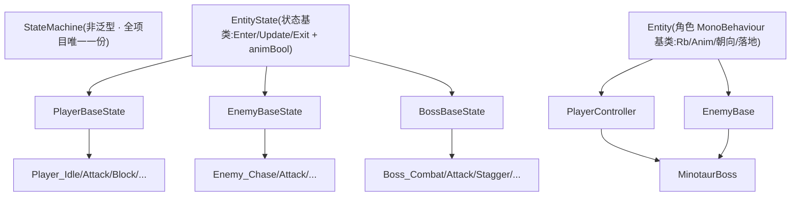

- **`StateMachine`(`StateMachine/StateMachine.cs`):** 非泛型、不关心 owner 是谁,全项目直接 `new StateMachine()` 共用。`ChangeState` 是经典 `Exit→换引用→Enter`(`:14`);`canChangeState`(Lock/Unlock)几乎只为主角死亡服务(死后锁死状态机,复活解锁),小怪 / boss 恒 `true`。
- **`EntityState`(`StateMachine/EntityState.cs`):** `Enter` 点亮 animBool、`Exit` 熄灭。**双轨动画驱动**:主角 / boss 给每个状态一个 Animator bool 走条件过渡;小怪 `animBoolName` 留空,`SetAnimBool` 对空名不做事(`:31`),改用手动 `Anim.Play`。同一套基类同时支持两种风格。
- **`Entity`(`StateMachine/Entity.cs`):** 统一朝向(`Flip`/`FacingDir`)与"指向某点"的工具 `DirToward/FaceToward`(`:35-40`),省掉到处手写 `Mathf.Sign(目标.x - 自身.x)`;`CheckGrounded` 默认空(仅主角覆盖)。
- **状态实例复用、不每次 new:** owner 初始化时把每个状态各 `new` 一个长期持有(`MinotaurBoss.cs:65-70`),切换只换引用 → 状态里不能假设 `Enter` 时字段是干净的,瞬时数据要在 `Enter` 显式重置。

**为什么值得:** 跨角色交互也走同一接口——boss 可以直接 `pc.stateMachine.ChangeState(pc.idleState)` 把玩家踢进某状态(`MinotaurBoss.cs:142`),二阶段演出正是靠它冻结 / 恢复玩家。一份状态机,三端 + 跨端复用。

### 2.5 数据驱动:ScriptableObject + SerializeReference

**设计意图:** 把"配置"从代码里搬出来,让策划 / 美术改资产不改代码。项目用两种互补的数据驱动:

**(a) ScriptableObject 数据契约层(`Assets/Scripts/Data/`):** `ItemData / EquipmentData / SkillData / DialogueSequence / BossProfile` 都标 `[CreateAssetMenu]`,Project 右键即可造资产、Inspector 填数值 / 图标,运行时各系统**只读**(共享只读模板)。它们几乎不依赖任何运行时系统(只 `using UnityEngine`),是依赖图的**叶子**。
> 关键约束:能被读档解析的三类(Item/Equipment/Skill)必须放在 `Resources/Data/` 下,因为 `SaveSystem.ResolveAsset` 靠 `Resources.LoadAll` 用 `saveID` 反查资产(存档只能存字符串 ID,不能存对象引用)。

**(b) SerializeReference 多态可插拔(统一攻击系统):** 敌人 / boss 的连段配置里,"出招前位移"和"出招时编排"是可在 Inspector 下拉切换的多态对象:

```csharp
// EnemyBase.cs  ComboStep
[SerializeReference, SubclassSelector] public StepMover        preMove; // :191 逼近/后撤/瞬移/跳
[SerializeReference, SubclassSelector] public AttackDriverBase driver;  // :193 前冲/挑飞
```

`[SerializeReference]` 让一个字段能序列化**任意子类实例**,配自定义 `[SubclassSelector]` 抽屉(`Editor/SubclassSelectorDrawer.cs`)在 Inspector 直接下拉选类型。**为什么用它而不是给每种招写一个 MonoBehaviour / SO:** 一只怪的连段是"数据里嵌一串行为对象",用 `SerializeReference` 能把这些行为**内联进同一份怪物配置、按需组合**,加新招式 = 加一个 `StepMover`/`AttackDriverBase` 子类,不改运行器。小怪与 boss 共用同一套 `AttackRunner` 跑连段——数据驱动让"小怪 + boss 合一套攻击系统"成立。

### 2.6 分层依赖(自底向上)

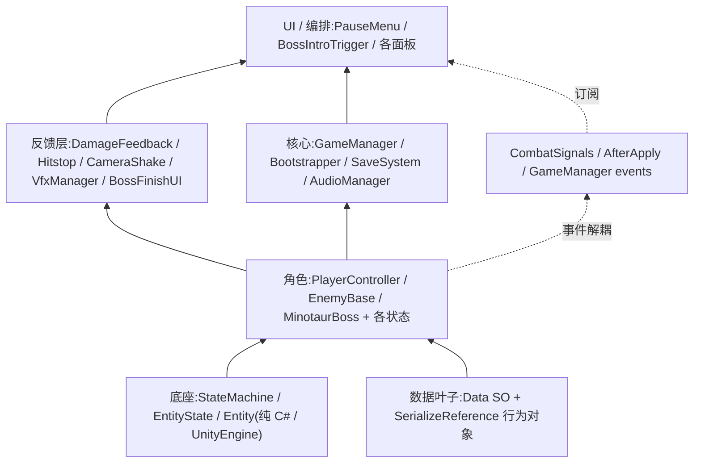

底座与数据层不反向依赖任何业务;反馈层与逻辑层解耦;跨系统协作尽量走事件而非直接引用。这套分层是前面所有"为什么"的落点——**每一层只认识它下面的层和一组事件契约,新增功能时改动面被约束在最小范围。**


---

## 附录:待你补充的地方(具体数值 / 设计取舍的个人想法)

**敌人 / Boss 系统**
- [ ] 识破削韧量 counterPoiseDamage 与完美格挡削韧量 perfectBlockPoiseDamage(在 PlayerStats,第 3 章)
- [ ] 处决对 Boss 的扣血量(Player_ExecuteState 传入 OnExecuted 的 dmg)
- [ ] 各怪 maxHP/attack/goldDrop、每招 HitProfile 的伤害倍率/击退/红白、每套连段的 range/hpPercent/weight(在场景 prefab Inspector,非代码默认值)
- [ ] 二阶段各连段的招表与具体数值

**反馈手感框架 + 工程架构总览**
- [ ] 文档 代码导览/08-Feedback 仍描述旧版'换材质 + RestoreMaterials + warningHeld'的受击闪白;当前代码 DamageFeedback.cs 已重写为 MaterialPropertyBlock + HitFlash Shader 双通道方案。本节已按代码为准,建议作者回头同步该导览文档。
- [ ] 本节所引反馈数值(顿帧 0.1/0.04、闪白 flashDuration 0.1、震屏 0.12/0.4 等)均为代码默认参数;若作者试玩后已在 Inspector 上覆盖为不同值,请以场景/prefab 实例值为准替换。

